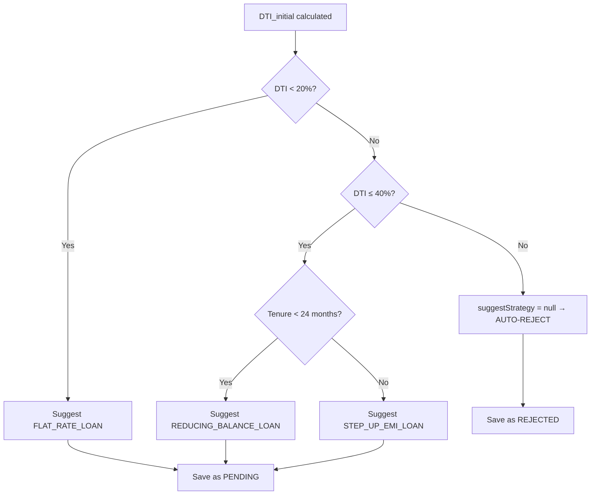
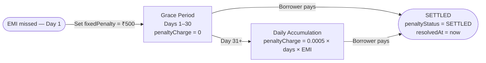
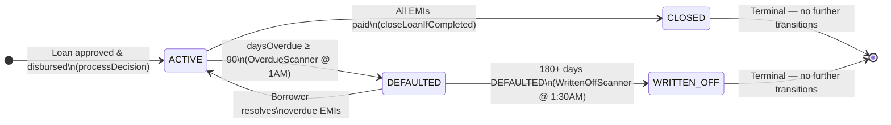

# Core Loan EMI Business Logic

---

## 1. DTI Calculation — Two Phases

### DTI_initial — Phase 1 (Early Screening)

DTI stands for Debt-to-Income ratio. It measures what percentage of a borrower's monthly income is already committed to debt repayments.

**DTI_initial** is calculated at the moment a borrower submits a loan application, before any officer has reviewed it and before any interest rate has been set. It is an early-screening signal based entirely on information available at submission time.

**Formula:**

    DTI_initial = (internalEmi + externalEmi) / monthlyIncome × 100

- **internalEmi** is the sum of monthly EMIs the borrower is already paying on active loans held within this system. It is fetched by querying the loan repository for all active loans belonging to the borrower and summing their stored monthly EMI values.
- **externalEmi** is the borrower's total monthly debt obligations outside this system — credit cards, personal loans from other banks, etc. This figure is fetched from the Credit Bureau at the time of application submission.
- **monthlyIncome** is the self-declared monthly income submitted by the borrower in the application form.

**What DTI_initial decides:**

DTI_initial drives two immediate decisions in the application flow:

1. **Auto-reject gate:** If DTI_initial exceeds 40%, the application is immediately and automatically rejected with a system-generated rejection reason. No officer review takes place. The application is saved with status REJECTED.
2. **Strategy suggestion:** If DTI_initial is within acceptable bounds (≤ 40%), the system suggests the most appropriate repayment strategy for the officer to consider. This suggestion is stored on the loan application record.

---

### DTI_final — Phase 2 (Post-Approval Informational Check)

**DTI_final** is calculated after the officer has set the interest rate and after the full EMI schedule has been generated for the new loan. At this point, the exact EMI for the new loan is known.

**Formula:**

    DTI_final = (internalEmi + externalEmi + newLoanEmi) / monthlyIncome × 100

- The first two components are the same as DTI_initial.
- **newLoanEmi** is the actual base EMI of the newly created loan, calculated by the strategy engine using the officer-set interest rate, tenure, and approved amount.

**What DTI_final tells the officer:**

DTI_final gives the officer an accurate picture of how financially stretched the borrower will be after this loan is added to their obligations. It is logged in the audit trail alongside the approval decision.

**Why DTI_final does NOT automatically reject or change the strategy:**

DTI_final is purely informational. Once the officer has made an approval decision and set the interest rate, the system calculates DTI_final and records it — but it does not enforce any threshold on it. The code that would have thrown a rejection if DTI_final exceeded 40% is present as a commented-out block in the loan service, indicating a deliberate design choice to leave final enforcement to officer judgment. This preserves officer discretion for edge cases (for example, a borrower with unusually high income relative to the loan amount, or a guarantor arrangement).

### DTI Phases — Quick Comparison

| Aspect | DTI_initial | DTI_final |
|---|---|---|
| When calculated | At application submission (`apply()`) | After officer sets rate, EMI schedule generated (`processDecision()`) |
| Formula | `(internalEmi + externalEmi) / income × 100` | `(internalEmi + externalEmi + newLoanEmi) / income × 100` |
| Includes new loan EMI? | No | Yes |
| Enforcement | Hard gate — auto-rejects if > 40% | None — informational only (enforcement block commented out) |
| Drives | Auto-reject OR strategy suggestion | Audit log entry; officer judgment only |
| Stored on | `LoanApplication.calculatedDti` | Logged in `AuditLog.remarks` |

---

## 2. Strategy Selection Rules

### How DTI_initial Maps to a Strategy

The strategy suggestion logic is defined in `DtiCalculationServiceImpl.suggestStrategy()`:

- **DTI_initial below 20%** → FLAT_RATE_LOAN is suggested. The borrower's debt burden is low. Flat rate is simpler to understand and carries predictable, equal payments every month.
- **DTI_initial between 20% and 40% (inclusive)** → Either REDUCING_BALANCE_LOAN or STEP_UP_EMI_LOAN is suggested, depending on the requested loan tenure (see below).
- **DTI_initial above 40%** → No strategy is returned (null). The application is auto-rejected at the application service layer.

### How Tenure Affects the REDUCING vs STEP_UP Decision

Within the 20%–40% DTI band, the tenure of the loan determines which of the two strategies is suggested:

- **Tenure less than 24 months** → REDUCING_BALANCE_LOAN is suggested. Short-term borrowers benefit from a consistent fixed EMI with rapidly decreasing interest exposure.
- **Tenure 24 months or more** → STEP_UP_EMI_LOAN is suggested. For longer tenures, the borrower likely anticipates income growth over time, so lower initial payments that increase each year align better with their financial trajectory.

The constant `STEP_UP_TENURE_THRESHOLD = 24` controls this boundary.

### What Happens When DTI Exceeds 40%

When DTI_initial is above 40%, `suggestStrategy()` returns null. The application service layer treats a null strategy as a signal to auto-reject. The application is saved with status REJECTED, a rejection reason is written to the record ("Auto-rejected: DTI X% exceeds 40% threshold"), and an audit log entry is created with action AUTO_REJECTED.

### Whether the Borrower Can Choose a Strategy

Borrowers cannot choose a repayment strategy. The system computes a suggestion automatically from DTI and tenure. The loan officer may override this suggestion by specifying a different strategy in the decision request. The final strategy used is whatever the officer submits (or, if the officer submits no override, the system suggestion). This design ensures that strategy selection is a risk-management decision made by a qualified officer, not a preference exercise by the borrower.

### Strategy Decision Matrix

| DTI_initial | Tenure (months) | Suggested Strategy | Outcome |
|---|---|---|---|
| < 20% | Any | `FLAT_RATE_LOAN` | PENDING, officer reviews |
| 20% – 40% | < 24 | `REDUCING_BALANCE_LOAN` | PENDING, officer reviews |
| 20% – 40% | ≥ 24 | `STEP_UP_EMI_LOAN` | PENDING, officer reviews |
| > 40% | Any | `null` (auto-reject) | REJECTED immediately, no officer review |

---

## 3. EMI Calculation per Strategy

### FLAT_RATE Strategy

In a flat-rate loan, interest is always calculated on the **original approved principal** throughout the entire loan tenure — the outstanding balance is irrelevant. This is the defining characteristic of flat-rate loans.

**Monthly principal component** = approved amount ÷ tenure months. This is equal in every installment.

**Monthly interest component** = approved amount × monthly rate. This is also equal in every installment because the base (original principal) never changes.

**Monthly EMI** = monthly principal + monthly interest.

Because both components are fixed for the life of the loan, the total EMI amount is identical every month. The borrower pays the same number every month regardless of how much principal remains. This is simpler for borrowers to understand but results in higher effective interest than reducing balance, because interest is not reduced as the outstanding balance falls.

### REDUCING_BALANCE Strategy

In a reducing balance loan, interest each month is charged only on the **outstanding (remaining) principal**, not on the original amount. As the borrower repays principal each month, the outstanding balance falls, so the interest component shrinks month by month.

**EMI formula (PMT formula):**

    EMI = P × r × (1+r)^n / ((1+r)^n − 1)

Where P is the approved principal, r is the monthly interest rate (annual rate ÷ 1200), and n is the tenure in months.

This formula is calculated once and the result is fixed for all installments.

**Each month's interest** = outstanding balance × monthly rate. This decreases every month.

**Each month's principal** = fixed EMI − that month's interest. This increases every month as interest falls.

Even though the split between principal and interest changes in every installment, the **total EMI amount remains the same** throughout the loan. The borrower sees a constant payment amount, but the composition of that payment shifts over time from interest-heavy to principal-heavy.

### STEP_UP Strategy

The Step-Up strategy shares its base EMI formula with Reducing Balance — the same PMT formula is used to compute the starting EMI. However, the EMI is not held constant. It increases by 5% at the start of every new calendar year of the loan (where year 1 is months 1–12, year 2 is months 13–24, and so on).

**Year index** = (installment number − 1) ÷ 12, using integer division.

**EMI for that installment** = baseEmi × (1.05)^yearIndex

This means:
- Months 1–12: base EMI (multiplied by 1.05^0 = 1.0)
- Months 13–24: base EMI × 1.05
- Months 25–36: base EMI × 1.05² = base EMI × 1.1025
- And so on.

**Which EMI is used for DTI_final and why:** The base EMI (installment 1 amount) is stored as the loan's monthlyEmi field and is used for DTI_final calculation. This provides a conservative minimum-payment figure for the debt burden assessment. Using the stepped-up values would overstate the burden for early months, and using a future-year value would understate affordability at loan origination.

### How the Final Installment Rounding Problem Is Solved

All three strategies use floating-point and fixed-precision arithmetic across many installments (up to 360). Rounding at each step causes a tiny residual balance — typically one or two paise — that accumulates and means the loan technically never reaches exactly zero after the standard calculation.

All three strategies detect the last installment (when the installment counter equals the tenure) and use a special adjustment: the final EMI is set to `remainingBalance + lastMonthInterest` rather than the standard formula result. This ensures the remaining balance is forced to exactly zero. The `MoneyUtil.adjustFinalEmi()` method encapsulates this correction and is called consistently by all three strategy classes on the last installment.

### EMI Strategy Comparison

| Feature | FLAT_RATE | REDUCING_BALANCE | STEP_UP |
|---|---|---|---|
| Interest charged on | Original principal (fixed forever) | Outstanding balance (shrinks monthly) | Outstanding balance (shrinks monthly) |
| Monthly EMI amount | Same every month | Same every month | Increases 5% each year |
| Monthly principal component | Fixed | Increases over time | Varies monthly |
| Monthly interest component | Fixed | Decreases over time | Decreases over time |
| Base formula | `P/n + P×r` | PMT: `P×r×(1+r)^n / ((1+r)^n−1)` | Same PMT as base, then `× 1.05^yearIndex` |
| EMI stored as `monthlyEmi` | Installment 1 amount | Installment 1 amount | Base EMI (year 1, before step-up) |
| Higher effective interest? | Yes (interest never reduces) | No | Between the two |
| Best for | Low DTI, short-term, simple | Medium DTI, < 24 months | Medium DTI, ≥ 24 months |

### Step-Up Annual EMI Multipliers (for reference)

| Loan Year | Months | Multiplier | Effect on base EMI |
|---|---|---|---|
| Year 1 | 1 – 12 | 1.05⁰ = 1.0000 | Base EMI unchanged |
| Year 2 | 13 – 24 | 1.05¹ = 1.0500 | +5.00% |
| Year 3 | 25 – 36 | 1.05² = 1.1025 | +10.25% |
| Year 4 | 37 – 48 | 1.05³ = 1.1576 | +15.76% |
| Year 5 | 49 – 60 | 1.05⁴ = 1.2155 | +21.55% |

---

## 4. Penalty Logic

### When the Flat Fee Is Applied and How Much

A flat penalty fee of ₹500 is applied on the **first day the EMI is detected as overdue** by the daily scanner. This is a one-time charge per overdue EMI, regardless of how long the EMI stays unpaid. The amount is defined by the constant `LATE_FEE_FLAT_AMOUNT = 500.00`.

### The Grace Period

After the flat fee is applied, the borrower enters a **30-day grace period** (`PENALTY_GRACE_DAYS = 30`). During this entire grace period, the daily penalty charge is zero. Only the flat fee is outstanding. The borrower can settle the overdue EMI within 30 days and only pay the ₹500 flat fee with no additional daily accumulation.

### How Daily Penalty Accumulates After the Grace Period

Once the days-overdue count exceeds 30, a daily penalty charge is calculated as:

    penaltyCharge = OVERDUE_DAILY_PENALTY_RATE × daysOverdue × totalEmiAmount

Where `OVERDUE_DAILY_PENALTY_RATE = 0.0005` (0.05% per day) and `totalEmiAmount` is the full EMI amount of the overdue installment. The charge is cumulative — it represents the total accumulated daily penalty from day one through the current day, recalculated fresh on each daily scan. It is not a daily increment added to a running total; it is recomputed from scratch each time.

### How Total Penalty Is Calculated

The total penalty the borrower owes for an overdue EMI is:

    totalPenalty = fixedPenaltyAmount + penaltyCharge

- `fixedPenaltyAmount` is always ₹500 once detected.
- `penaltyCharge` is zero during the grace period and then grows each day after the grace period expires.

Both components are stored on the `OverdueTracker` entity and can be inspected at any time.

### When and How Penalty Is Settled

When a borrower makes a payment for an overdue EMI (via the payment simulation endpoint), the system checks if the EMI's previous status was OVERDUE. If so, it finds the corresponding `OverdueTracker` record and sets `resolvedAt` to the current timestamp and `penaltyStatus` to `SETTLED`. The loan's overdue count is also decremented. The penalty fields themselves are not cleared — they remain as an immutable historical record of what was incurred.

### Penalty Stages at a Glance

| Stage | Days Overdue | Flat Fee | Daily Charge (`penaltyCharge`) | Total Penalty |
|---|---|---|---|---|
| Detection | Day 1 | ₹500 applied | ₹0 | ₹500 |
| Grace Period | Days 2 – 30 | ₹500 (unchanged) | ₹0 | ₹500 |
| Post-Grace | Day 31+ | ₹500 (unchanged) | `0.0005 × daysOverdue × totalEmiAmount` | ₹500 + daily charge |
| Settled | On payment | Recorded (not cleared) | Recorded (not cleared) | `penaltyStatus = SETTLED` |

### Key Penalty Constants

| Constant | Value | Purpose |
|---|---|---|
| `LATE_FEE_FLAT_AMOUNT` | ₹500 | One-time flat fee on first detection |
| `PENALTY_GRACE_DAYS` | 30 days | Grace window before daily charge starts |
| `OVERDUE_DAILY_PENALTY_RATE` | 0.0005 (0.05%/day) | Rate used in `penaltyCharge` formula |
| `DEFAULT_THRESHOLD_DAYS` | 90 days | Days overdue before loan becomes DEFAULTED |
| `WRITTEN_OFF_DAYS` | 180 days | Days DEFAULTED before loan becomes WRITTEN_OFF |

---

## 5. Loan Lifecycle Status Rules

### When a Loan Becomes DEFAULTED

A loan transitions from ACTIVE to DEFAULTED when an overdue tracker for any EMI belonging to that loan shows `daysOverdue >= 90` (defined by `DEFAULT_THRESHOLD_DAYS = 90`). This check happens during the daily overdue scanner run. The transition is performed by the `LoanStatusTransitionService`, which also records a row in the `LoanStatusHistory` table with the reason.

### When a Loan Becomes WRITTEN_OFF

Loans that are already in DEFAULTED status are scanned daily by a separate written-off scan (running at 1:30 AM). Any DEFAULTED loan whose `updatedAt` timestamp is more than 180 days in the past (`WRITTEN_OFF_DAYS = 180`) is transitioned to WRITTEN_OFF. The `LoanStatusTransitionService` handles this transition and writes a history record.

### Why CLOSED and WRITTEN_OFF Are Terminal States

The status transition state machine in `LoanStatusTransitionServiceImpl` defines exactly which transitions are allowed:

- ACTIVE → CLOSED (all EMIs paid)
- ACTIVE → DEFAULTED (90+ days overdue)
- DEFAULTED → ACTIVE (if the borrower resolves overdue payments)
- DEFAULTED → WRITTEN_OFF (180+ days defaulted)
- CLOSED → (no further transitions allowed)
- WRITTEN_OFF → (no further transitions allowed)

CLOSED means all financial obligations have been met. WRITTEN_OFF means the institution has given up on recovering the debt. Both are end states with no valid path forward. Making them terminal prevents erroneous re-activation of settled or written-off loan accounts.

### What the State Machine Protects Against

The state machine throws an `InvalidStatusTransitionException` if any code attempts an illegal transition (such as moving a CLOSED loan back to ACTIVE, or transitioning directly from ACTIVE to WRITTEN_OFF). This protects against bugs, race conditions in schedulers, or incorrect API calls that could corrupt the loan's financial history.

### Loan Lifecycle State Diagram

### Allowed Transitions Table

| From | To | Trigger | Who | LoanStatusHistory row written? |
|---|---|---|---|---|
| *(new)* | ACTIVE | Loan approved | Officer via `processDecision()` | No (starts directly as ACTIVE) |
| ACTIVE | CLOSED | All EMI installments PAID | System — `closeLoanIfCompleted()` | Yes |
| ACTIVE | DEFAULTED | Any EMI `daysOverdue ≥ 90` | System — `OverdueScanner` @ 1AM | Yes |
| DEFAULTED | ACTIVE | Borrower clears overdue EMIs | System | Yes |
| DEFAULTED | WRITTEN_OFF | Loan DEFAULTED for 180+ days | System — `WrittenOffScanner` @ 1:30AM | Yes |
| CLOSED | *(none)* | Terminal | — | — |
| WRITTEN_OFF | *(none)* | Terminal | — | — |
