# Entity Design Decisions — Cascade, Lazy Loading, Fetch Strategy, and Relationship Direction

---

## 1. Why Cascade Is NOT Used (and Why This Is Correct)

### What Cascade Would Do if Enabled on Loan → EmiSchedule

If `CascadeType.ALL` or `CascadeType.PERSIST` were set on a `Loan.emiSchedules` collection, saving a `Loan` entity that had a populated list of `EmiSchedule` objects would automatically trigger Hibernate to insert all schedule rows. This sounds convenient but creates serious problems in a financial system.

### Why Generating 360 EMI Rows via Cascade Would Cause Silent Failures

When the loan is approved, the system must generate between 1 and 360 installment rows depending on the loan tenure. Hibernate's cascade handling writes these rows one at a time, outside the application's direct visibility. If any row fails — due to a validation constraint, a null field, or a rounding edge case — the failure may be swallowed or surface as an ambiguous Hibernate exception without identifying which installment failed or why. There is no opportunity for the application to log what was being persisted, inject business logic between rows, or retry a specific failed row. The entire financial schedule could be partially committed or silently incomplete.

### Why Payment → EmiSchedule Has No Cascade

`Payment.emiSchedule` is a reference to an existing `EmiSchedule` row. The payment service never needs to create or delete EMI schedule rows — it only reads them. If cascade were present, deleting a `Payment` record would cascade into deleting the associated `EmiSchedule`, permanently erasing the borrower's installment record. This would destroy the loan's amortization history. The absence of cascade here is a data integrity safeguard.

### Why OverdueTracker Has No Cascade from Loan

An `OverdueTracker` is created by the overdue scanner when it detects a missed payment. It tracks penalty, days overdue, and resolution status for a specific EMI. If cascade were enabled from `Loan` to `OverdueTracker`, deleting a loan entity would silently delete all overdue history associated with it, erasing the audit trail of missed payments and penalties. Each tracker must be explicitly managed by the scanner and payment services.

### The General Rule

In financial systems, every database write must be explicit, traceable, and independently verifiable. Cascade makes writes implicit — the application code delegates to Hibernate, which inserts or deletes rows without explicit service-layer calls. This makes it impossible to log, audit, retry, or control each individual write. The design principle in this codebase is that every `INSERT` or `UPDATE` to a financially-significant table is a deliberate, named method call in a service class.

### Cascade Decision Summary

| Relationship | Cascade Set? | Risk if Cascade Were Enabled | Who Manages the Write Instead |
|---|---|---|---|
| `Loan` → `EmiSchedule` | ❌ None | Hibernate inserts 1–360 rows silently; failures undetectable per row | `EmiScheduleServiceImpl.generateSchedule()` → `saveAll()` |
| `Payment` → `EmiSchedule` | ❌ None | Deleting a Payment would delete the EMI row, erasing amortization history | Never deleted; only read |
| `Loan` → `OverdueTracker` | ❌ None | Deleting a Loan would delete overdue audit trail | `OverdueMonitorServiceImpl.scanAndMarkOverdue()` |
| `Loan` → `Payment` | ❌ None | Deleting a Loan would erase payment receipts | `PaymentServiceImpl.simulatePayment()` |
| `Loan` → `LoanStatusHistory` | ❌ None | Deleting a Loan would erase status change history | `LoanStatusTransitionServiceImpl.transition()` |

---

## 2. Why LAZY Loading Is Used Everywhere

### What EAGER Loading Would Do When Loading a Loan Entity

With `FetchType.EAGER`, loading a single `Loan` entity would cause Hibernate to immediately join-fetch or execute additional queries to load every associated entity: the `LoanApplication`, the approving officer (`User`), and the borrower (`User`). If `EmiSchedule` were eagerly loaded from `Loan`, loading one loan would also load all its installment rows — potentially 360 rows — in the same operation.

### How LAZY Loading Prevents Loading the Entire Object Graph

With `FetchType.LAZY` (the setting used on every relationship in this codebase), Hibernate does not execute any additional query for associated entities when the parent is loaded. Instead, it returns a proxy object. The actual data is only fetched from the database when the application code explicitly accesses a field on that proxy. This means loading a `Loan` entity to check its status or strategy executes exactly one SQL query, not a cascade of joins.

### The Specific Risk with Eager Borrower Loading

If the `User → Loan` or `Borrower → LoanApplication` relationship were eagerly loaded, a simple request to fetch a borrower's profile would trigger the load of all their loans, which would in turn load all loan applications, and potentially all EMI schedules. For a borrower with multiple long-term loans, this could mean loading hundreds to thousands of rows for what should be a lightweight profile query. LAZY loading ensures each query only fetches what is needed for that specific operation.

### How @Transactional Boundaries Keep LAZY Proxies Alive

A LAZY proxy can only be accessed within an active Hibernate session. Outside of a `@Transactional` boundary, the session is closed and accessing an uninitialized proxy throws a `LazyInitializationException`. All service methods in this codebase are annotated with `@Transactional` (or `@Transactional(readOnly = true)`), which keeps the session open for the duration of the method. LAZY proxies accessed within the service boundary (e.g., calling `emi.getLoan()` inside the overdue scanner's transaction) are initialized on demand without error.

---

## 3. EAGER Loading — Where and Why It Would Be a Problem

### Why No Entity in This Project Uses EAGER

No relationship in this project specifies `FetchType.EAGER`. The JPA default for `@ManyToOne` and `@OneToOne` is technically EAGER, but every such relationship in this codebase explicitly declares `fetch = FetchType.LAZY`, overriding the default. `@OneToMany` and `@ManyToMany` already default to LAZY. This uniform declaration makes the fetch strategy explicit, visible, and consistent rather than relying on JPA defaults that can change between providers.

### The N+1 Problem if EmiSchedule.loan Were EAGER

In the daily overdue scanner, the repository fetches a list of `EmiSchedule` entities whose status is PENDING and due date is before today. If `EmiSchedule.loan` were declared EAGER, Hibernate would execute one additional SQL query per schedule row to load the associated `Loan` entity. For 100 overdue EMIs, this would be 100 extra queries — the classic N+1 problem. With LAZY loading, accessing `emi.getLoan()` inside the transactional scanner method loads the loan with a single query, and Hibernate can batch or join these loads efficiently.

### How the Overdue Scheduler Would Behave with EAGER vs LAZY

With EAGER: fetching 200 overdue EMI rows would immediately trigger 200 queries to load each associated `Loan`, plus potentially 200 more for each `Loan`'s `LoanApplication`, and so on down the graph. The scheduler, which runs at 1 AM on potentially thousands of records, could execute tens of thousands of SQL queries for a single run.

With LAZY (current implementation): the repository query fetches the list of `EmiSchedule` rows. Each `emi.getLoan()` call inside the transaction initializes the proxy and triggers a separate SQL query per loan unless a batch fetch size is configured or the query uses an explicit `JOIN FETCH`. LAZY loading defers these extra queries to the access point, making it possible to optimize with JOIN FETCH or batch-fetch hints when needed — but it does not eliminate N+1 automatically. The key advantage is that services which do not access `loan` at all pay zero cost, unlike EAGER which always loads it.

### EAGER vs LAZY — Impact Table

| Scenario | With EAGER | With LAZY (current) |
|---|---|---|
| Load 1 `Loan` | Joins `LoanApplication` + 2× `User` automatically | 1 query; associations loaded only if accessed |
| Overdue scanner — 200 EMIs | 200 extra queries for `Loan`, 200 for `LoanApplication`, ... | 1 query for EMI list; each `emi.getLoan()` access triggers a per-row query unless JOIN FETCH or batch fetch is used |
| Borrower profile fetch | Loads all their `Loan`s → all `EmiSchedule`s → thousands of rows | 1 query; no downstream loading |
| `LazyInitializationException` risk | None (always loaded) | Only outside `@Transactional`; all services are `@Transactional` |
| JPA annotation required | `fetch = FetchType.EAGER` or default for `@ManyToOne` | `fetch = FetchType.LAZY` (explicit on every field) |

---

## 4. Unidirectional Relationships — Why No Bidirectional

### What Bidirectional Means

A bidirectional relationship means both entities hold a reference to each other. For example, a `Loan` would have a `List<EmiSchedule>` field AND `EmiSchedule` would have a `Loan loan` field — both sides of the association are mapped in Java.

### Why Loan Does Not Have a List of EmiSchedule

If `Loan` held a `List<EmiSchedule>`, every time a `Loan` entity is loaded into any service that calls any method on it, the application would need to be careful never to accidentally initialize that collection — even within a transaction. A call to `loan.getEmiSchedules().size()` inside a `@Transactional` method would trigger the loading of all 360 rows unexpectedly. Developers relying on IDE autocompletion or iterating over the collection without realizing the cost could introduce performance regressions that are invisible in development (where loan tenures are short) but severe in production.

### Why User Does Not Have a List of LoanApplication

If `User` held a `List<LoanApplication>`, loading any user entity in any context — security filter, admin lookup, notification recipient resolution — would carry the risk of initializing all their loan applications. With LAZY loading, the list would be a proxy, but even the proxy's existence as a field invites accidental access. More importantly, any JSON serializer that introspects the object (without careful `@JsonIgnore` annotations) could trigger loading and serialization of the entire collection, causing infinite loops or massive response payloads.

### The Hidden Costs of Bidirectional Relationships

**Accidental loading:** The presence of a collection field is an open invitation for accidental initialization, especially when entities are passed through multiple service layers or mapped to DTOs.

**Infinite JSON serialization loops:** If `Loan` contains `List<EmiSchedule>` and `EmiSchedule` contains `Loan loan`, a JSON serializer will follow each reference indefinitely unless `@JsonIgnore` or `@JsonManagedReference`/`@JsonBackReference` annotations are carefully applied everywhere.

**Dirty collection tracking:** Hibernate tracks all changes to managed collections. If a bidirectional collection is loaded, Hibernate must check at flush time whether the collection was modified, even if the application never intended to change it.

### How the Repository Layer Handles Queries Instead

Instead of navigating collections, all cross-entity queries in this codebase use explicit repository methods. For example:

- To get all EMI schedules for a loan: `EmiScheduleRepository.findByLoanOrderByInstallmentNumberAsc(loan)`.
- To count unpaid EMIs for a loan: `EmiScheduleRepository.countByLoanAndStatusNot(loan, EmiStatus.PAID)`.
- To find all applications for a borrower: `LoanApplicationRepository.findByBorrowerOrderByCreatedAtDesc(borrower)`.

Each of these is a focused SQL query that returns exactly the data needed, without loading any parent entity's collection.

### Bidirectional vs Unidirectional Trade-offs

| Aspect | Bidirectional (NOT used) | Unidirectional (used everywhere) |
|---|---|---|
| Collection on parent | Yes — e.g., `Loan.emiSchedules` | No — parent has no child collection |
| Accidental load risk | High — any `loan.getEmiSchedules()` call | None — no collection to access |
| JSON serialization | Risk of infinite loop without `@JsonIgnore` | No risk — no back-reference |
| Hibernate dirty tracking | Tracks collection changes on every flush | No collection to track |
| Cross-entity queries | Navigate via collection field | Explicit repository method call |

---

## 5. Entity-by-Entity Relationship Explanation

### User

`User` is the root entity. It has no outgoing foreign-key relationships to business entities. All other entities reference `User` through `@ManyToOne` or `@OneToOne` join columns. This is a deliberate root-of-graph design: `User` can be loaded cheaply without dragging in any downstream business data.

### LoanApplication → User (borrower), User (reviewedBy, nullable)

`LoanApplication` references `User` twice:
- `borrower` (via `borrower_id`, non-nullable): the borrower who submitted the application. Direction: application → borrower. The application knows who applied; the borrower entity is unaware of their applications.
- `reviewedBy` (via `reviewed_by`, nullable): the officer who reviewed the application. This field is null until an officer takes action. Direction: application → officer.

### Loan → LoanApplication (OneToOne), User (borrower), User (approvedBy)

`Loan` references three entities:
- `application` (OneToOne, LAZY, unique): links the loan back to the application that created it. The `unique = true` constraint on the join column ensures one application cannot produce two loans.
- `borrower` (ManyToOne, LAZY): the borrower who owns the loan.
- `approvedBy` (ManyToOne, LAZY): the officer who approved the loan. Non-nullable — a loan cannot exist without an approving officer.

### EmiSchedule → Loan (ManyToOne)

`EmiSchedule` holds a `@ManyToOne` reference to its `Loan`. Many schedules belong to one loan. The direction is one-way: the schedule knows its parent loan; the loan does not hold a collection of schedules. All schedule queries are performed via the repository with the loan entity as a parameter.

### Payment → EmiSchedule (OneToOne unique), Loan, User

`Payment` references three entities:
- `emiSchedule` (OneToOne, LAZY, unique): the specific installment this payment covers. The `unique = true` constraint is the database-level double-payment guard. One EMI can have at most one payment row.
- `loan` (ManyToOne, LAZY): a direct reference to the loan, used for efficient payment-by-loan queries without going through the EMI schedule.
- `borrower` (ManyToOne, LAZY): the user who made the payment, used for audit and ownership checks.

### OverdueTracker → EmiSchedule (OneToOne unique), Loan, User

`OverdueTracker` references three entities:
- `emiSchedule` (OneToOne, LAZY, unique): the overdue installment being tracked. The `unique = true` constraint ensures one overdue installment has at most one tracker record.
- `loan` (ManyToOne, LAZY): direct loan reference for querying all trackers for a loan without joining through the schedule.
- `borrower` (ManyToOne, LAZY): the borrower responsible for the overdue payment, used for notification targeting.

### LoanStatusHistory → Loan, User (changedBy, nullable)

`LoanStatusHistory` references two entities:
- `loan` (ManyToOne, LAZY): the loan whose status changed. Non-nullable.
- `changedBy` (ManyToOne, LAZY, nullable): the user who triggered the change. This is null for system-triggered transitions (overdue scanner, written-off scanner) and set to the officer's entity for manual transitions.

### Notification → User (recipient), Loan (nullable)

`Notification` references two entities:
- `recipient` (ManyToOne, LAZY): the user to whom the notification is addressed. Non-nullable — every notification has a target.
- `loan` (ManyToOne, LAZY, nullable): an optional loan reference for loan-related notifications (EMI reminders, approval decisions, overdue alerts). Null for account-level notifications such as registration confirmations.

### AuditLog → User (performedBy, nullable)

`AuditLog` references one entity:
- `performedBy` (ManyToOne, LAZY, nullable): the user who performed the audited action. Null when the action was system-generated (overdue scanner, written-off scanner, automated jobs). Non-null for officer and borrower actions.

### Entity Reference Summary Table

| Entity | References | Cardinality | Nullable? | DB Column | Why Direct Reference |
|---|---|---|---|---|---|
| `LoanApplication` | `User borrower` | ManyToOne | No | `borrower_id` | Know who applied |
| `LoanApplication` | `User reviewedBy` | ManyToOne | **Yes** | `reviewed_by` | Set only after officer acts |
| `Loan` | `LoanApplication application` | OneToOne | No | `application_id` (unique) | Trace loan back to its origin |
| `Loan` | `User borrower` | ManyToOne | No | `borrower_id` | Ownership, EMI queries |
| `Loan` | `User approvedBy` | ManyToOne | No | `approved_by` | Accountability |
| `EmiSchedule` | `Loan loan` | ManyToOne | No | `loan_id` | Each installment knows its loan |
| `Payment` | `EmiSchedule emiSchedule` | OneToOne | No | `emi_schedule_id` (unique) | Double-payment DB guard |
| `Payment` | `Loan loan` | ManyToOne | No | `loan_id` | Direct payment-by-loan query |
| `Payment` | `User borrower` | ManyToOne | No | `borrower_id` | Audit, ownership |
| `OverdueTracker` | `EmiSchedule emiSchedule` | OneToOne | No | `emi_schedule_id` (unique) | One tracker per missed EMI |
| `OverdueTracker` | `Loan loan` | ManyToOne | No | `loan_id` | Direct overdue-by-loan query |
| `OverdueTracker` | `User borrower` | ManyToOne | No | `borrower_id` | Notification targeting |
| `LoanStatusHistory` | `Loan loan` | ManyToOne | No | `loan_id` | Full transition audit trail |
| `LoanStatusHistory` | `User changedBy` | ManyToOne | **Yes** | `changed_by` | Null for system-triggered changes |
| `Notification` | `User recipient` | ManyToOne | No | `recipient_id` | Who receives the email |
| `Notification` | `Loan loan` | ManyToOne | **Yes** | `loan_id` | Null for account-level notifications |
| `AuditLog` | `User performedBy` | ManyToOne | **Yes** | `performed_by` | Null for SYSTEM-role actions |

### Entity Relationship Diagram

```mermaid
erDiagram
    User {
        Long id PK
        String email UK
        Role role
        boolean isActive
        boolean isDeleted
    }
    LoanApplication {
        Long id PK
        String applicationNumber UK
        ApplicationStatus status
        LoanStrategy suggestedStrategy
        LoanStrategy finalStrategy
        BigDecimal calculatedDti
    }
    Loan {
        Long id PK
        String loanNumber UK
        LoanStatus status
        LoanStrategy strategy
        BigDecimal monthlyEmi
        Integer tenureMonths
    }
    EmiSchedule {
        Long id PK
        Integer installmentNumber
        LocalDate dueDate
        BigDecimal totalEmiAmount
        EmiStatus status
    }
    Payment {
        Long id PK
        String receiptNumber UK
        BigDecimal paidAmount
        LocalDateTime paidAt
    }
    OverdueTracker {
        Long id PK
        Integer daysOverdue
        BigDecimal fixedPenaltyAmount
        BigDecimal penaltyCharge
        PenaltyStatus penaltyStatus
        LocalDateTime resolvedAt
    }
    LoanStatusHistory {
        Long id PK
        LoanStatus oldStatus
        LoanStatus newStatus
        LocalDateTime changedAt
    }
    Notification {
        Long id PK
        NotificationEventType eventType
        NotificationStatus status
        Integer retryCount
    }
    AuditLog {
        Long id PK
        EntityType entityType
        String action
        String oldStatus
        String newStatus
        LocalDateTime createdAt
    }

    User ||--o{ LoanApplication : "borrower_id"
    User ||--o{ Loan : "borrower_id"
    User ||--o{ Payment : "borrower_id"
    User ||--o{ OverdueTracker : "borrower_id"
    User ||--o{ Notification : "recipient_id"
    LoanApplication ||--o| Loan : "application_id (unique)"
    Loan ||--o{ EmiSchedule : "loan_id"
    Loan ||--o{ Payment : "loan_id"
    Loan ||--o{ OverdueTracker : "loan_id"
    Loan ||--o{ LoanStatusHistory : "loan_id"
    Loan ||--o{ Notification : "loan_id (nullable)"
    EmiSchedule ||--o| Payment : "emi_schedule_id (unique)"
    EmiSchedule ||--o| OverdueTracker : "emi_schedule_id (unique)"
```

---

## 6. The unique=true Constraint on Payment.emiSchedule

### What This Constraint Does at the DB Level

The `@JoinColumn(name = "emi_schedule_id", nullable = false, unique = true)` annotation on `Payment.emiSchedule` generates a `UNIQUE` constraint on the `emi_schedule_id` column in the `payments` table at the database level. The database enforces this independently of the application layer: no matter how many concurrent threads attempt to insert a payment for the same EMI schedule, only the first successful `INSERT` will be accepted. All subsequent inserts for the same `emi_schedule_id` value will fail with a unique constraint violation.

### Why This Is the Real Guard Against Double Payment

Application-layer checks (checking the EMI's current status before inserting) are susceptible to race conditions. Two threads could simultaneously read an EMI's status as PENDING, both conclude the payment is valid, and both attempt to insert a `Payment` row. The service-layer guard would pass for both threads. The database `UNIQUE` constraint is the only mechanism that can guarantee exactly one payment per EMI under concurrent load — the database serializes the two inserts and rejects the second.

### How It Works Together with the Service-Layer Guard

The service guard (`ValidationUtil.ensureEmiNotAlreadyPaid(emi)`) runs first in the transaction. For the common case (no concurrency), it catches the double-payment attempt before any database interaction and returns a descriptive error message to the client. The database constraint is the safety net for edge cases where the service guard is bypassed by concurrent requests. Together, the two guards provide both good developer experience (clear error messages) and correctness guarantees (database-level enforcement).

### Double-Payment Guard Layers

| Guard Layer | Location | Mechanism | Catches | Limitation |
|---|---|---|---|---|
| Service guard | `ValidationUtil.ensureEmiNotAlreadyPaid()` | Check `emi.status == PAID` | Sequential duplicate calls | Race condition — two concurrent reads both see PENDING |
| DB constraint | `payments.emi_schedule_id UNIQUE` | Database unique index | Concurrent inserts | Throws `DataIntegrityViolationException` — must be caught |

---

## 7. BaseEntity Design

### What @Version Does and What Optimistic Locking Prevents

Every entity extending `BaseEntity` has a `@Version` field of type `Long`. JPA uses this for optimistic locking: when an entity is updated, Hibernate includes `WHERE version = currentVersion` in the UPDATE SQL and increments the version column. If two transactions read the same entity simultaneously and both attempt to update it, the second update will find that the version column no longer matches (it was incremented by the first update) and will throw an `OptimisticLockException`. This prevents lost updates — a scenario where the second writer silently overwrites the first writer's changes without either party knowing.

### Why @CreatedBy and @LastModifiedBy Auto-Populate and How

`@CreatedBy` and `@LastModifiedBy` are Spring Data JPA auditing annotations. When an entity is first persisted, Spring Data invokes the `AuditorAware<String>` bean (defined in `JpaAuditingConfig.auditorProvider()`) to obtain the current auditor string and populates `createdBy` with it. On every subsequent save, `updatedBy` is set to the current auditor. The auditor provider reads the `Authentication` from `SecurityContextHolder`: if a user is authenticated, the email (username) is returned; otherwise `"SYSTEM"` is returned for scheduled jobs and background operations. This means all entity rows carry a human-readable record of who created and last modified them.

### Why AuditLog Does NOT Extend BaseEntity

`AuditLog` is itself an audit record. It would be nonsensical (and potentially recursive) for an audit log entry to have its own versioning, its own audit trail of who created and modified it, and its own `updatedAt` timestamp. Audit log entries are immutable records of past events — they are written once and never updated. Giving them `@Version`, `@LastModifiedDate`, and `@LastModifiedBy` fields would add overhead with no benefit and would imply they could be modified, which they must not be.

Instead, `AuditLog` has a single `createdAt` field populated directly with `LocalDateTime.now()` in the field initializer, bypassing the JPA Auditing infrastructure entirely. It has its own `@Id` with `@GeneratedValue(strategy = GenerationType.IDENTITY)` for consistency with other entities.

### What @EntityListeners(AuditingEntityListener.class) Does

This annotation is placed on `BaseEntity` (the superclass). It tells JPA to attach the Spring Data auditing listener to every entity that extends `BaseEntity`. The listener intercepts `@PrePersist` and `@PreUpdate` lifecycle events and populates the `@CreatedDate`, `@CreatedBy`, `@LastModifiedDate`, and `@LastModifiedBy` fields automatically before the entity is written to the database. Without this listener, those annotations would have no effect. `@EnableJpaAuditing(auditorAwareRef = "auditorProvider")` in `JpaAuditingConfig` activates this mechanism globally.

### BaseEntity Fields Reference

| Field | Annotation | Type | Populated By | Mutable? | Present on AuditLog? |
|---|---|---|---|---|---|
| `id` | `@Id @GeneratedValue(IDENTITY)` | `Long` | Database auto-increment | No (`updatable=false`) | Yes (own `@Id`) |
| `createdAt` | `@CreatedDate` | `LocalDateTime` | `AuditingEntityListener` on `@PrePersist` | No (`updatable=false`) | Yes (own field, `LocalDateTime.now()`) |
| `createdBy` | `@CreatedBy` | `String` | `AuditorAware` bean (email or "SYSTEM") | No (`updatable=false`) | No |
| `updatedAt` | `@LastModifiedDate` | `LocalDateTime` | `AuditingEntityListener` on `@PreUpdate` | Yes | No |
| `updatedBy` | `@LastModifiedBy` | `String` | `AuditorAware` bean | Yes | No |
| `version` | `@Version` | `Long` | Hibernate (optimistic lock counter) | Managed by Hibernate | No |

### Entities Extending BaseEntity vs AuditLog

| Entity | Extends BaseEntity | Has @Version | Has @CreatedBy/@LastModifiedBy | Has updatedAt |
|---|---|---|---|---|
| `User`, `Loan`, `LoanApplication`, `EmiSchedule`, `Payment`, `OverdueTracker`, `LoanStatusHistory`, `Notification` | ✅ Yes | ✅ Yes | ✅ Yes | ✅ Yes |
| `AuditLog` | ❌ No | ❌ No | ❌ No | ❌ No (immutable) |
