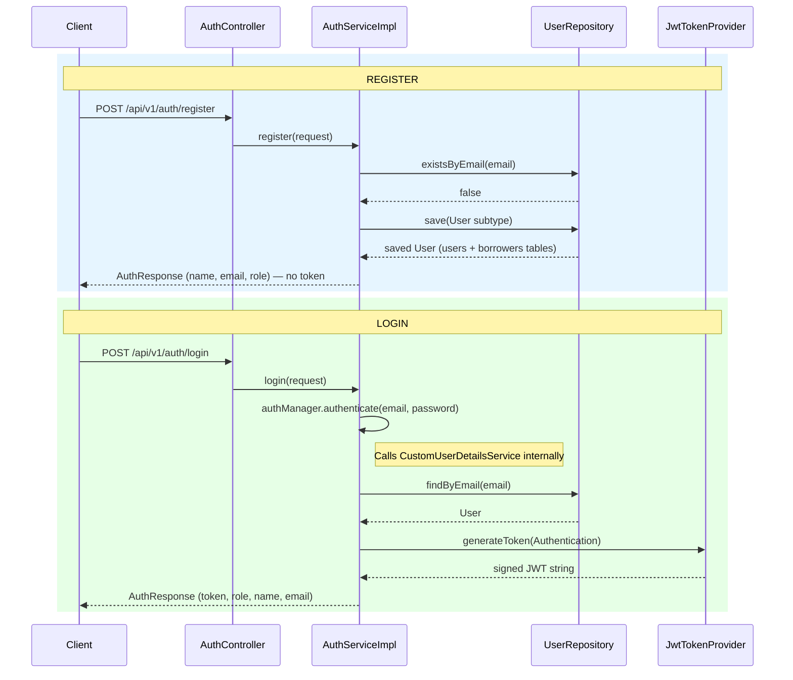
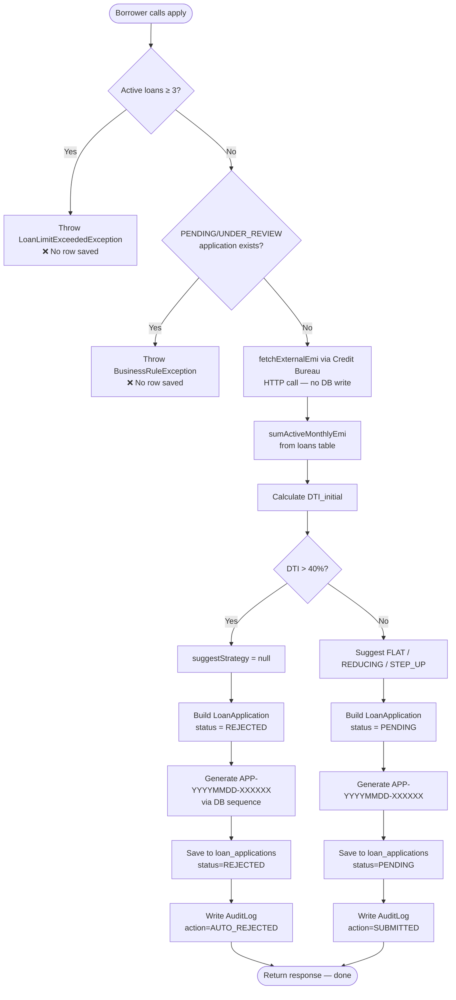
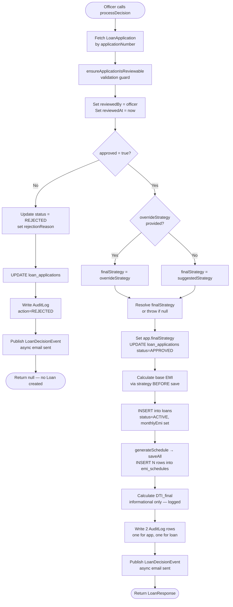
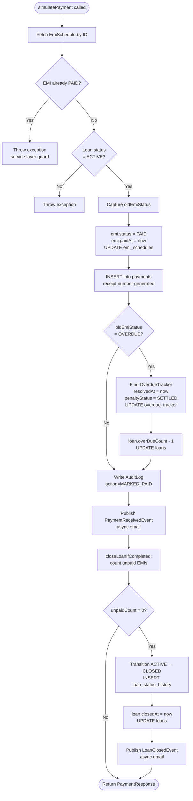

# Complete Project Flow — Where Everything Is Saved, Changed, Rejected, and Why

---

## 1. Borrower Registration and Login

### Registration

When a borrower calls the registration endpoint, the `AuthServiceImpl.register()` method runs. It first checks the `users` table for a duplicate email. If the email is already taken, a `BusinessRuleException` is thrown.

The request carries a `role` field (BORROWER, LOAN_OFFICER, or ADMIN). Based on this role, a subtype-specific entity is constructed: a `Borrower` object includes PAN number, date of birth, occupation, and monthly income; a `LoanOfficer` includes employee ID and designation; an `Admin` includes access level.

Common fields (name, email, BCrypt-hashed password, phone, role) are set on the base `User` entity. The `isActive` flag is set to true and the `isDeleted` flag to false. The record is saved to the `users` table (and into the corresponding joined table — `borrowers`, `loan_officers`, or `admins` — via JPA's JOINED inheritance strategy).

**What the JWT contains at registration:** Registration does not issue a JWT token. The response only contains the user's name, email, and role. The borrower must perform a separate login to receive a token.

### Login

When a borrower calls the login endpoint, `AuthServiceImpl.login()` delegates authentication to Spring Security's `AuthenticationManager`. The manager calls `CustomUserDetailsService.loadUserByUsername()`, which fetches the `User` from the `users` table, checks if the account is deleted or deactivated, builds a `UserDetails` object with the ROLE_ prefixed authority, and returns it. The `AuthenticationManager` then verifies the submitted password against the stored BCrypt hash.

If authentication succeeds, `JwtTokenProvider.generateToken(Authentication)` is called. It creates a JWT with the borrower's email as the subject, the current timestamp as `issuedAt`, the expiry timestamp as `expiration`, and a `roles` claim containing the list of granted authorities (e.g., `["ROLE_BORROWER"]`). The token is signed using an HMAC-SHA key derived from the Base64-encoded secret in application configuration.

The response carries the token, the user's name, email, and role. The role is stored both inside the JWT as a claim and in the `users` table as an enum column.

### Registration and Login Sequence

### What Gets Saved at Registration

| Table | Row content | When |
|---|---|---|
| `users` | `id, name, email, bcrypt_password, phone, role, is_active=true, is_deleted=false` | On `userRepository.save()` |
| `borrowers` | `id (FK), pan_number, date_of_birth, occupation, monthly_income` | Same save (JOINED inheritance) |
| `loan_officers` | `id (FK), employee_id, designation` | Same save (JOINED inheritance) |
| `admins` | `id (FK), access_level` | Same save (JOINED inheritance) |

---

## 2. Loan Application Submission (apply())

The `LoanApplicationServiceImpl.apply()` method handles the full application submission flow.

### Guards

Two guards run before any business logic:

1. **Active loan limit guard:** The system counts how many loans in the `loans` table have status ACTIVE for this borrower. If the count equals or exceeds 3 (`MAX_ACTIVE_LOANS`), a `LoanLimitExceededException` is thrown and no application is created.
2. **Duplicate pending application guard:** The system checks the `loan_applications` table for any record belonging to this borrower with status PENDING or UNDER_REVIEW. If one exists, a `BusinessRuleException` is thrown.

### Credit Bureau Call

The `CreditBureauService.fetchExternalEmi()` method is called with the borrower's PAN number. This performs an HTTP call to the external credit bureau. The result contains the borrower's total external monthly EMI obligations and a bureau status flag (`"AVAILABLE"` if the bureau responded, `"UNAVAILABLE"` if it was unreachable). No table row is written for this call — the result flows directly into the application.

### Internal EMI Fetch

The `LoanRepository.sumActiveMonthlyEmi()` query runs against the `loans` table to sum the monthly EMI values of all ACTIVE loans for this borrower. This represents the borrower's existing obligations within this system.

### DTI_initial Calculation

The DTI service calculates DTI_initial as `(internalEmi + externalEmi) / monthlyIncome × 100`. The result is rounded to two decimal places.

### Strategy Suggestion

`DtiCalculationService.suggestStrategy()` maps the DTI_initial value and requested tenure to a strategy: FLAT_RATE_LOAN (DTI < 20%), REDUCING_BALANCE_LOAN (DTI 20–40%, tenure < 24 months), STEP_UP_EMI_LOAN (DTI 20–40%, tenure ≥ 24 months), or null (DTI > 40%).

### Auto-Reject Path

If the suggested strategy is null (DTI > 40%):

- A `LoanApplication` entity is built with status REJECTED and a rejection reason.
- An application number is generated using a database sequence (`APP-YYYYMMDD-XXXXXX`).
- The application is saved to the `loan_applications` table.
- An `AuditLog` record is written with action `AUTO_REJECTED`, new status `REJECTED`, actor role `BORROWER`, and the DTI value in remarks.
- The response is returned immediately. No event is fired for auto-rejections.

### PENDING Path

If the strategy is not null:

- A `LoanApplication` entity is built with status PENDING, the calculated DTI, the suggested strategy, bureau status, and the external EMI value.
- An application number is generated using the same sequence pattern.
- The application is saved to the `loan_applications` table.
- An `AuditLog` record is written with action `SUBMITTED`, new status `PENDING`, performed by the borrower.
- The response is returned.

**What the audit log captures:** Entity type (`LOAN_APPLICATION`), entity ID, action name, new status, the performing user object, actor role, and optional remarks. Old status is recorded for state changes; it is null for initial creation events.

### Loan Application Submission Flow

### What Gets Saved During apply()

| Step | Table | Action | Key Fields |
|---|---|---|---|
| Guard 1 fail | — | Exception thrown | — |
| Guard 2 fail | — | Exception thrown | — |
| Credit Bureau call | — | HTTP only, no DB write | — |
| Auto-reject path | `loan_applications` | INSERT | `status=REJECTED`, `rejection_reason`, `calculated_dti`, `application_number` |
| Auto-reject path | `audit_logs` | INSERT | `action=AUTO_REJECTED`, `actor_role=BORROWER` |
| PENDING path | `loan_applications` | INSERT | `status=PENDING`, `suggested_strategy`, `calculated_dti`, `bureau_status`, `application_number` |
| PENDING path | `audit_logs` | INSERT | `action=SUBMITTED`, `new_status=PENDING`, `performed_by=borrower` |

---

## 3. Officer Review and Decision (processDecision())

The `LoanServiceImpl.processDecision()` method handles the full approval or rejection decision.

### Validation

The officer calls the endpoint with an application number. The system fetches the `LoanApplication` from the `loan_applications` table. `ValidationUtil.ensureApplicationIsReviewable()` confirms the application is in a state that allows review. The officer is recorded on the application via `reviewedBy` and `reviewedAt`, capturing who reviewed it and when.

### Rejection by Officer

If the officer's decision is to reject (`approved = false`):

- The application status is updated to REJECTED with the officer's rejection reason.
- The `loan_applications` table row is updated.
- An `AuditLog` is written with action `REJECTED`.
- A `LoanDecisionEvent` is published. The event listener sends a rejection notification email to the borrower asynchronously.
- The method returns null — no loan entity is created.

### Officer Override vs System Suggestion

If the officer provides an `overrideStrategy` in the request, that strategy is used as the final strategy. If no override is provided, the system's suggested strategy from DTI_initial is used. If neither is available (null suggested and no override), a `BusinessRuleException` is thrown.

### Approval Sequence

1. The application's `finalStrategy` field is set to the resolved strategy.
2. The application status is updated to APPROVED in the `loan_applications` table.
3. A new `Loan` entity is created with a generated loan number (`LN-YYYYMMDD-XXXXXX` via database sequence), linked to the application, the borrower, and the approving officer.
4. Loan fields are set: approved amount, officer-set interest rate, tenure, strategy, status (ACTIVE), disbursed timestamp, and outstanding principal.
5. **Before saving the loan**, the strategy engine calculates the base EMI — this is required because the `loans` table has a NOT NULL constraint on `monthly_emi`. The base EMI is set on the loan entity.
6. The loan is saved to the `loans` table.
7. `EmiScheduleService.generateSchedule()` is called, which triggers the selected strategy class to build the full amortization schedule and bulk-save all installment rows to the `emi_schedules` table.
8. DTI_final is calculated using the actual base EMI of the new loan, the borrower's existing EMI obligations, and their monthly income. This is logged but not used for enforcement.
9. Two `AuditLog` records are written: one for the loan application approval and one for the loan creation.
10. A `LoanDecisionEvent` is published. The listener sends an approval notification email asynchronously.

### How the Loan Number Is Generated

A database sequence is queried via `LoanRepository.getNextLoanSequence()`. The result is combined with today's date to produce a unique, human-readable identifier in the format `LN-YYYYMMDD-000001`.

### What LoanStatusHistory Captures and When

The `LoanStatusTransitionService.transition()` method is not called during initial loan creation — the loan starts directly as ACTIVE. `LoanStatusHistory` rows are only written when the loan transitions between existing states (ACTIVE → DEFAULTED, DEFAULTED → WRITTEN_OFF, etc.). Each history record stores the old status, new status, the user who triggered the change (or null for system-triggered changes), the reason text, and the exact timestamp of the transition.

### Officer Decision Flow

### What Gets Saved During processDecision() — Approval Path

| Order | Table | Action | Key Data |
|---|---|---|---|
| 1 | `loan_applications` | UPDATE | `status=APPROVED`, `final_strategy`, `reviewed_by`, `reviewed_at` |
| 2 | `loans` | INSERT | `loan_number`, `strategy`, `monthly_emi`, `status=ACTIVE`, `disbursed_at` |
| 3 | `emi_schedules` | BULK INSERT (`saveAll`) | N rows (N = tenure months); each has `installment_number`, `due_date`, `principal`, `interest`, `total_emi`, `remaining_balance` |
| 4 | `audit_logs` | INSERT × 2 | Row 1: `entity_type=LOAN_APPLICATION, action=APPROVED` / Row 2: `entity_type=LOAN, action=CREATED` |
| 5 | `notifications` | INSERT (async) | Via `NotificationEventListener` after `LoanDecisionEvent` |

---

## 4. EMI Schedule Generation

The `EmiScheduleServiceImpl.generateSchedule()` method delegates to the strategy-specific class resolved by `LoanStrategyFactory`.

- **FlatRateStrategy** calculates fixed monthly principal and interest components from the original principal, then builds one `EmiSchedule` row per installment.
- **ReducingBalanceStrategy** uses the PMT formula to compute a fixed EMI, then derives each month's interest from the outstanding balance and principal as the difference.
- **StepUpEmiStrategy** uses the PMT formula for the base EMI, then applies the 5% annual multiplier for each year index when constructing each row.

All three strategies build a `List<EmiSchedule>` and return it to the service. The service calls `emiScheduleRepository.saveAll(schedule)` — a single bulk-insert operation that sends one SQL batch statement for all installments rather than executing individual `INSERT` statements in a loop. For a 30-year loan, this inserts 360 rows in a single call. After saving, the service returns the first installment's `totalEmiAmount`, which is stored back on the `Loan` entity as `monthlyEmi`.

### Strategy Class Responsibilities

| Strategy Class | Algorithm | Rows Generated | `saveAll()` call |
|---|---|---|---|
| `FlatRateStrategy` | Fixed P/n + P×r for every row | `tenureMonths` | Yes — single batch |
| `ReducingBalanceStrategy` | PMT formula once; per-row interest = balance × rate | `tenureMonths` | Yes — single batch |
| `StepUpEmiStrategy` | PMT for base; per-row EMI = base × 1.05^yearIndex | `tenureMonths` | Yes — single batch |

---

## 5. Borrower Payment Simulation

`PaymentServiceImpl.simulatePayment()` processes a payment against a specific EMI schedule entry.

### Two Guards

1. **Service-layer guard:** `ValidationUtil.ensureEmiNotAlreadyPaid(emi)` checks the EMI's current status before any database write. This is the first line of defense and gives a clear error message.
2. **Database constraint guard:** The `payments` table has a `UNIQUE` constraint on the `emi_schedule_id` column. Even if two concurrent requests passed the service guard simultaneously, the database would reject the second insert with a constraint violation. This is the true safety net against double payment.

Both guards exist because the service guard provides developer-friendly error messages, while the database constraint provides correctness guarantees even under concurrent load.

### How the Overdue Tracker Is Resolved

After the EMI is marked PAID, the service checks whether the EMI's previous status was OVERDUE. If it was, the system finds the corresponding `OverdueTracker` record via `overdueTrackerRepository.findByEmiSchedule(emi)`. The tracker's `resolvedAt` timestamp is set to now and its `penaltyStatus` is set to SETTLED. The loan's `overDueCount` field is decremented by 1, floored at 0.

### How the Loan Closure Check Works

After every payment, `LoanService.closeLoanIfCompleted()` queries the `emi_schedules` table to count how many installments for this loan do not have status PAID. If that count is zero, the loan transitions to CLOSED via `LoanStatusTransitionService.transition()`, the loan's `closedAt` timestamp is set, and the loan is saved.

### What Fires When the Last EMI Is Paid

A `LoanClosedEvent` is published. The event listener handles this asynchronously and sends a loan closure notification email to the borrower.

### Payment Simulation Flow

---

## 6. Daily Overdue Scanner (Scheduler)

The `OverdueScheduler` runs the scan at **1:00 AM every day** via the cron expression `0 0 1 * * *`.

### Query

The scanner calls `EmiScheduleRepository.findByStatusAndDueDateBefore(EmiStatus.PENDING, today)`. This finds all installments that are still in PENDING status but whose due date has already passed — these are missed payments.

### Step-by-Step Processing of Each Missed EMI

1. **Capture old status:** Before any mutation, the current status (`PENDING`) is captured as a string for the audit log.
2. **Mark EMI as OVERDUE:** The EMI's status is updated to `OVERDUE` and saved to the `emi_schedules` table.
3. **Create or update OverdueTracker:** The system looks for an existing `OverdueTracker` for this EMI. If none exists, a new one is created. If one already exists (from a previous scan cycle), it is updated. The tracker fields are set: the EMI reference, loan reference, borrower reference, original due date, and current days-overdue count (calculated as the number of days between the due date and today).
4. **Set detectedAt:** Only set on the first detection, never overwritten on subsequent scan cycles.
5. **Apply penalty:** The `applyPenalty()` method is called. It sets the ₹500 flat fee on first detection, holds `penaltyCharge` at zero during the grace period, and computes the accumulated daily penalty charge after the grace period expires.
6. **Save tracker:** The updated `OverdueTracker` is saved to the `overdue_tracker` table.
7. **Increment loan overdue count:** The loan's `overDueCount` field is incremented and the updated loan is saved to the `loans` table.
8. **DEFAULTED check:** If `daysOverdue >= 90` and the loan is still ACTIVE, `LoanStatusTransitionService.transition()` is called to move the loan to DEFAULTED. A `LoanStatusHistory` row is saved. The loan is saved again to the `loans` table.
9. **Send alert (once):** If the tracker's `alertCount` is zero, an `OverdueAlertEvent` is published. The event listener sends an overdue alert notification email asynchronously. The `alertCount` is set to 1 and `lastAlertAt` is recorded so the alert is never sent more than once per EMI.
10. **Write audit log:** An `AuditLog` record is created with entity type `EMI_SCHEDULE`, action `MARK_OVERDUE`, the captured old status (`PENDING`), new status (`OVERDUE`), actor role `SYSTEM`, and remarks that include the days overdue and penalty amounts. Using the pre-captured old status ensures the audit log accurately reflects the state before the change even if the same record were processed in a subsequent pass.

### Second Pass: Updating Already-Detected Trackers

After processing newly-detected overdue EMIs, the scanner runs a second loop: it fetches all `OverdueTracker` records whose `resolvedAt` is null (still unresolved). For each, it recalculates `daysOverdue` and reapplies the penalty. This second pass is essential — without it, the `daysOverdue` counter would freeze at 1 and the DEFAULTED threshold would never be reached for EMIs detected on earlier days.

### Overdue Scanner — DB Writes Per Missed EMI

| Step | Table | Operation | Notes |
|---|---|---|---|
| Mark OVERDUE | `emi_schedules` | UPDATE | `status = OVERDUE` |
| Create/update tracker | `overdue_tracker` | INSERT or UPDATE | `detectedAt` only set once |
| Apply penalty | `overdue_tracker` | UPDATE | `fixed_penalty=500`, `penalty_charge` after grace |
| Increment overdueCount | `loans` | UPDATE | `over_due_count + 1` |
| DEFAULTED transition (if ≥ 90d) | `loans` | UPDATE | `status = DEFAULTED` |
| DEFAULTED transition (if ≥ 90d) | `loan_status_history` | INSERT | `old=ACTIVE, new=DEFAULTED` |
| Alert (first time only) | `notifications` | INSERT (async) | `alertCount` set to 1 after |
| Audit log | `audit_logs` | INSERT | `entity_type=EMI_SCHEDULE, action=MARK_OVERDUE` |

---

## 7. Written-Off Scan (Scheduler)

The `OverdueScheduler` runs the written-off scan at **1:30 AM every day** via cron `0 30 1 * * *`.

### Query

`LoanRepository.findByStatusAndUpdatedAtBefore(LoanStatus.DEFAULTED, cutoff)` finds all loans with status DEFAULTED whose `updatedAt` timestamp is earlier than 180 days ago. The `updatedAt` field is managed by JPA Auditing and is refreshed whenever the loan entity is saved, so it accurately reflects when the loan last changed state.

### What Transition Service Does and What It Saves

For each qualifying loan, `LoanStatusTransitionService.transition()` is called with target status WRITTEN_OFF. The state machine validates the transition (DEFAULTED → WRITTEN_OFF is allowed). The loan's status is updated. A `LoanStatusHistory` row is saved with old status DEFAULTED, new status WRITTEN_OFF, changedBy null (system action), reason "Loan written off after 180 days of DEFAULTED status", and the current timestamp. The loan entity is then saved to the `loans` table. An audit log entry is also written for each written-off loan.

---

## 8. Notification Retry Scheduler

The `NotificationRetryScheduler` runs every **30 minutes** via cron `0 0/30 * * * *`.

### Query

`NotificationRepository.findByStatusAndRetryCountLessThan(NotificationStatus.FAILED, MAX_NOTIFICATION_RETRIES)` finds all notification records with status FAILED whose retry count is less than 3. This excludes notifications that have already been retried the maximum number of times.

### How Retry Count Grows and When It Stops

The `NotificationService.resend()` method is called for each retryable notification. It attempts to send the email via `JavaMailSender`. If the attempt succeeds, the notification's status is updated to SENT and `sentAt` is recorded. If the attempt fails, the notification's `retryCount` is incremented by 1 and the failure reason is updated. The notification record is saved either way.

Once a notification's `retryCount` reaches 3, it will no longer be returned by the query (because the query filters for `retryCount < MAX_NOTIFICATION_RETRIES`). The notification remains in FAILED status indefinitely after exhausting all retries. No further send attempts are made automatically. An administrator can inspect failed notifications via the admin API.

---

## 9. Payment Reminder Scheduler

The `PaymentReminderScheduler` runs every day at **9:00 AM** via cron `0 0 9 * * *`.

### Query

`EmiScheduleRepository.findUpcomingEmisWithBorrower(EmiStatus.PENDING, reminderDate)` is called, where `reminderDate = today + PAYMENT_REMINDER_DAYS_BEFORE` (3 days). This query uses a `JOIN FETCH` to eagerly load the associated borrower in the same SQL statement, avoiding a separate lookup when building the reminder email. It returns all PENDING installments whose `dueDate` equals exactly 3 days from today.

### What Fires

For each returned `EmiSchedule`, a `PaymentReminderEvent` is published synchronously. The asynchronous event listener handles this and sends a reminder email to the borrower. No table row is written by the scheduler itself — the `notifications` table is written by the notification service called from the event listener.

### Why JOIN FETCH Is Used Here (Unlike the Overdue Scanner)

The overdue scanner processes EMIs inside a `@Transactional` service method, so LAZY proxies for `emi.getLoan()` and `emi.getLoan().getBorrower()` are safely initialized on demand. The payment reminder scheduler is `@Transactional(readOnly = true)`, but because the reminder email requires the borrower's email address, the query explicitly JOIN FETCHes the borrower to load everything in one SQL round-trip rather than triggering lazy initialization per row.

---

## Scheduler Summary

| Scheduler | Cron | Runs At | Primary Action | Tables Written |
|---|---|---|---|---|
| `OverdueScheduler.runOverdueScan` | `0 0 1 * * *` | 1:00 AM daily | Mark PENDING past-due EMIs as OVERDUE; apply penalties; check DEFAULTED | `emi_schedules`, `overdue_tracker`, `loans`, `loan_status_history`, `audit_logs`, `notifications` |
| `OverdueScheduler.runWrittenOffScan` | `0 30 1 * * *` | 1:30 AM daily | Transition DEFAULTED loans (180+ days) to WRITTEN_OFF | `loans`, `loan_status_history`, `audit_logs` |
| `NotificationRetryScheduler` | `0 0/30 * * * *` | Every 30 min | Resend FAILED notifications (retryCount < 3) | `notifications` |
| `PaymentReminderScheduler.runPaymentReminders` | `0 0 9 * * *` | 9:00 AM daily | Send reminder 3 days before EMI due date | `notifications` |

## Events and Async Notification Triggers

| Event | Published by | Async handler action | Table written |
|---|---|---|---|
| `LoanApplicationSubmittedEvent` | `apply()` (commented out) | — | — |
| `LoanDecisionEvent` (APPROVED) | `processDecision()` | Send approval email | `notifications` |
| `LoanDecisionEvent` (REJECTED) | `processDecision()` | Send rejection email | `notifications` |
| `PaymentReceivedEvent` | `simulatePayment()` | Send payment confirmation email | `notifications` |
| `LoanClosedEvent` | `closeLoanIfCompleted()` | Send loan closed email | `notifications` |
| `OverdueAlertEvent` | `scanAndMarkOverdue()` | Send overdue alert email (once per EMI) | `notifications` |
