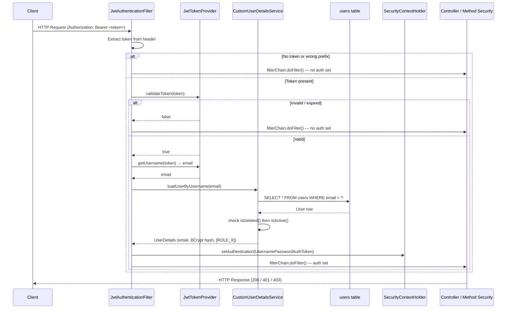
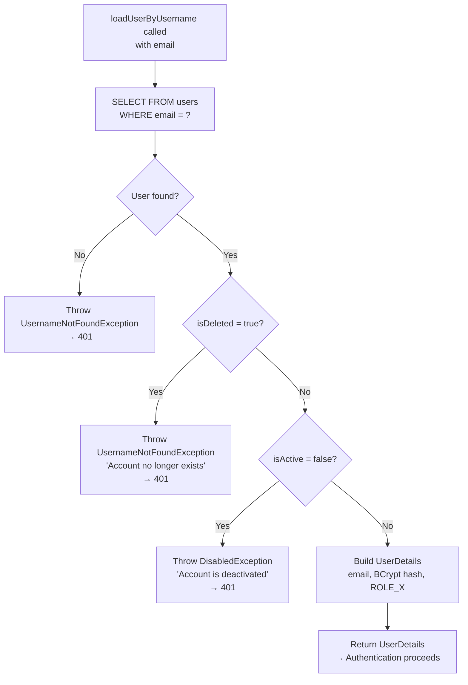

# How Spring Security Works in This Project

---

## 1. JWT Token — Structure and Lifecycle

### What Is Stored Inside the Token

A JWT (JSON Web Token) issued by this system contains the following:

- **Subject (`sub`):** The user's email address. Email is used as the unique principal identifier throughout the system because it uniquely identifies a user and is stored as the username in the `users` table.
- **Issued At (`iat`):** The timestamp at which the token was created.
- **Expiration (`exp`):** The timestamp after which the token is no longer valid. This is derived from the `jwt.expiration-ms` configuration property.
- **Roles claim (`roles`):** A list of granted authorities for the user. For a borrower this is `["ROLE_BORROWER"]`, for a loan officer `["ROLE_LOAN_OFFICER"]`, and for an admin `["ROLE_ADMIN"]`.

The token does not store the user's name, internal database ID, or any sensitive financial data. The email is the only identifier embedded in the token. All other user data is loaded from the database on each authenticated request.

### Difference Between generateToken and generateTokenForUser

There are two token generation methods in `JwtTokenProvider`:

**`generateToken(Authentication)`** is used at login. At this point, Spring Security has already authenticated the user and the `Authentication` object contains the fully populated `UserDetails` including granted authorities. The method extracts authorities directly from this object. This is the standard and preferred path because the authorities come from the verified `UserDetails` loaded by `CustomUserDetailsService`.

**`generateTokenForUser(User)`** is used at registration. At registration time, no `Authentication` object has been established — the user has just been saved to the database for the first time. The method manually constructs the role string as `"ROLE_" + user.getRole().name()` from the `User` entity directly. This provides a fallback for generating a token when Spring Security's authentication pipeline has not been invoked. In practice, the current implementation does not return a token from the registration endpoint, but the method exists for compatibility and potential future use.

Both methods produce tokens with identical structure and signing.

### How the Base64 Secret Key Is Used for Signing

The JWT secret is stored in configuration as a Base64-encoded string. `JwtTokenProvider` reads it via the `@Value("${jwt.secret}")` injection. When building or verifying a token, the provider decodes the Base64 string into raw bytes and constructs an HMAC-SHA `SecretKey` using the JJWT library's `Keys.hmacShaKeyFor()`. All tokens are signed and verified with this key. Anyone who possesses the key can forge tokens, so it must remain a secret and never be committed to source control.

### What Happens When the Token Expires

When a token's expiration time has passed, `JwtTokenProvider.validateToken()` catches the `ExpiredJwtException` thrown by the JJWT parser, logs a warning, and returns false. The filter does not set any authentication in the security context. The request is treated as unauthenticated. For a protected endpoint, Spring Security's `JwtAuthenticationEntryPoint` returns a 401 Unauthorized response. The client must obtain a new token by calling the login endpoint again.

### JWT Claims Reference Table

| Claim | Key | Example Value | Populated By |
|---|---|---|---|
| Subject (email) | `sub` | `borrower@example.com` | `generateToken` / `generateTokenForUser` |
| Issued at | `iat` | Unix timestamp | JJWT builder `.issuedAt(new Date())` |
| Expiration | `exp` | Unix timestamp (`iat + expiration-ms`) | JJWT builder `.expiration(expiryDate)` |
| Roles | `roles` | `["ROLE_BORROWER"]` | Extracted from `Authentication.getAuthorities()` |

### Token Generation Methods Compared

| Method | Used At | Authority Source | Returns Token to Client? |
|---|---|---|---|
| `generateToken(Authentication)` | Login | `Authentication.getAuthorities()` from `UserDetails` | Yes — in `AuthResponse.token` |
| `generateTokenForUser(User)` | Registration (fallback) | `"ROLE_" + user.getRole().name()` from entity | No — registration response omits token |

---

## 2. Request Authentication Flow — Step by Step

### How JwtAuthenticationFilter Runs

`JwtAuthenticationFilter` extends `OncePerRequestFilter`, which guarantees it executes exactly once per HTTP request, regardless of how many times the filter chain is invoked for a single request. It is registered in `SecurityConfig` to run before `UsernamePasswordAuthenticationFilter` in the filter chain order.

### How It Extracts the Bearer Token

The filter reads the value of the `Authorization` HTTP request header. If the header is present and starts with the prefix `"Bearer "`, the prefix is stripped and the remainder is treated as the JWT token string. If the header is absent or does not start with the prefix, the token variable is null and the rest of the authentication logic is skipped.

### How It Validates the Token

`JwtTokenProvider.validateToken(token)` is called. This method parses the JWT using the HMAC-SHA key, verifying both the signature and the expiration. If parsing succeeds, the method returns true. If any exception occurs (expired, malformed, unsigned, or empty), the method catches it, logs a warning at the appropriate level, and returns false. The method never throws — this is a deliberate design choice to keep the filter chain intact.

### How It Loads UserDetails

If the token is valid, the email is extracted from the token's subject claim via `JwtTokenProvider.getUsername(token)`. `CustomUserDetailsService.loadUserByUsername(email)` is then called, which queries the `users` table for that email. If the user is found and is neither deleted nor deactivated, a `UserDetails` object is returned containing the email as username, the BCrypt-hashed password, and the user's single role authority.

### How SecurityContext Is Set

A `UsernamePasswordAuthenticationToken` is constructed with the `UserDetails` object as the principal, null credentials (the password is not needed after initial authentication), and the collection of granted authorities from `UserDetails`. The token is enriched with request-specific web authentication details (IP address, session ID) via `WebAuthenticationDetailsSource`. This fully-constructed authentication token is then stored in `SecurityContextHolder.getContext().setAuthentication(...)`. From this point forward, any call to `SecurityContextHolder.getContext().getAuthentication()` anywhere in the request-handling code will return this authentication object.

### Why the Filter Always Calls filterChain.doFilter()

The `filterChain.doFilter(request, response)` call is placed at the very end of `doFilterInternal()`, outside the try-catch block. It runs regardless of whether authentication succeeded or failed. This design means:

- For valid tokens: the request proceeds with the security context set, and the downstream filter chain and controller process the authenticated request.
- For invalid/missing tokens: the request proceeds with no authentication context set. For public endpoints, the request succeeds. For protected endpoints, Spring Security's authorization layer intercepts the request and returns a 401 response. The filter does not decide authorization — it only sets up authentication when possible.

### Request Authentication Sequence Diagram



---

## 3. Public vs Protected Endpoints

### Which URLs Bypass JWT Completely

The following endpoints are configured to allow all requests without any authentication check:

- `/api/v1/auth/register` — borrowers must be able to create accounts before they have a token
- `/api/v1/auth/login` — users must be able to obtain a token before they have one
- `/actuator/health` — infrastructure health checks must be accessible without credentials
- `/v3/api-docs/**` — Swagger/OpenAPI spec generation
- `/swagger-ui/**` and `/swagger-ui.html` — interactive API documentation UI

### How SecurityConstants.PUBLIC_URLS Controls This in One Place

All public URLs are defined as a single String array constant `SecurityConstants.PUBLIC_URLS`. `SecurityConfig.filterChain()` reads this array directly in its `authorizeHttpRequests` configuration via `.requestMatchers(SecurityConstants.PUBLIC_URLS).permitAll()`. This centralization means that adding or removing a public endpoint requires changing only one place — the constant definition — rather than hunting through security configuration scattered across multiple files.

### What Happens with No Token vs Invalid Token

For requests to public endpoints: both cases result in the request being processed normally, since these endpoints require no authentication.

For requests to protected endpoints with no token: `JwtAuthenticationFilter` finds no Authorization header, sets no security context, and passes the request forward. The downstream authorization check finds no authenticated user and delegates to `JwtAuthenticationEntryPoint`, which returns a 401 response with a JSON error body.

For requests to protected endpoints with an invalid or expired token: `validateToken()` returns false (or throws a caught exception), no security context is set, and the same 401 path is taken.

### Public Endpoints Reference

| Endpoint | Method | Reason No Auth Required |
|---|---|---|
| `/api/v1/auth/register` | POST | User doesn't have a token yet |
| `/api/v1/auth/login` | POST | User doesn't have a token yet |
| `/actuator/health` | GET | Infrastructure / load-balancer health probes |
| `/v3/api-docs/**` | GET | OpenAPI spec for tooling |
| `/swagger-ui/**` | GET | API documentation browser |
| `/swagger-ui.html` | GET | API documentation browser |

### Token Presence vs Endpoint Type — Outcome Matrix

| Token Present? | Token Valid? | Endpoint Type | Result |
|---|---|---|---|
| No | — | Public | ✅ 200 — allowed |
| No | — | Protected | ❌ 401 — `JwtAuthenticationEntryPoint` |
| Yes | Expired | Public | ✅ 200 — allowed (no auth check) |
| Yes | Expired | Protected | ❌ 401 — filter sets no auth context |
| Yes | Valid | Public | ✅ 200 — allowed |
| Yes | Valid | Protected (correct role) | ✅ 200 — allowed |
| Yes | Valid | Protected (wrong role) | ❌ 403 — `AccessDeniedException` |

---

## 4. Role-Based Access Control

### How Roles Are Stored in the Token and in SecurityContext

In the token, roles are stored in a custom `roles` claim as a JSON array of strings. Each string is in the format `ROLE_BORROWER`, `ROLE_LOAN_OFFICER`, or `ROLE_ADMIN`. This format follows the Spring Security convention of prefixing authority names with `ROLE_`.

In the `SecurityContext`, roles are stored as `GrantedAuthority` objects inside the authentication token. `CustomUserDetailsService` constructs a `SimpleGrantedAuthority("ROLE_" + user.getRole().name())` from the user's stored role enum, adds it to a set of authorities, and this set is placed into the `UserDetails`. When `JwtAuthenticationFilter` creates the `UsernamePasswordAuthenticationToken`, it passes these authorities directly.

Note: The filter uses the authorities from the `UserDetails` loaded from the database on every request — it does not re-read the roles claim from the JWT. This means that if a user's role changes in the database, the change takes effect immediately on the next request, without waiting for the token to expire.

### How @PreAuthorize Reads from SecurityContext

`@PreAuthorize("hasRole('BORROWER')")` on a controller method instructs Spring Security's method security interceptor to check the current authentication in `SecurityContextHolder` before the method body executes. `hasRole('BORROWER')` automatically prepends `ROLE_` and looks for `ROLE_BORROWER` in the authentication's authorities. This matches the `SimpleGrantedAuthority` that was constructed during `loadUserByUsername`.

### How @EnableMethodSecurity Enables This

The `@EnableMethodSecurity` annotation on `SecurityConfig` activates Spring's method-level security processing. Without it, `@PreAuthorize` annotations on controller methods would be silently ignored and all authenticated users could access all endpoints regardless of their role.

### What Happens When a BORROWER Tries to Call an OFFICER Endpoint

If a borrower's valid JWT is used to call an endpoint annotated with `@PreAuthorize("hasRole('LOAN_OFFICER')")`, the method security interceptor evaluates the expression, finds that `ROLE_LOAN_OFFICER` is absent from the borrower's authorities, and throws an `AccessDeniedException`. The global exception handler maps this to a 403 Forbidden response.

### Role-to-Controller Access Matrix

| Controller | Annotation / Guard | BORROWER | LOAN_OFFICER | ADMIN |
|---|---|---|---|---|
| `BorrowerController` (all methods) | `@PreAuthorize("hasRole('BORROWER')")` | ✅ | ❌ 403 | ❌ 403 |
| `OfficerController` (all methods) | `@PreAuthorize("hasRole('LOAN_OFFICER')")` | ❌ 403 | ✅ | ❌ 403 |
| `AdminController` (all methods) | `@PreAuthorize("hasRole('ADMIN')")` | ❌ 403 | ❌ 403 | ✅ |
| `PaymentController` (simulate) | `@PreAuthorize("hasRole('BORROWER')")` | ✅ | ❌ 403 | ❌ 403 |
| `GET /loans/{id}/schedule` | `hasAnyRole('BORROWER','LOAN_OFFICER')` + ownership | ✅ (own only) | ✅ (any) | ❌ 403 |
| `GET /loans/{id}/payments` | `LOAN_OFFICER` bypass OR `isOwner` check | ✅ (own only) | ✅ (any) | ❌ 403 |
| `AuthController` (`/register`, `/login`) | Public (`permitAll`) | ✅ | ✅ | ✅ |

### Role Storage Path

```mermaid
flowchart LR
    A[users.role column\nEnum: BORROWER] -->|CustomUserDetailsService| B["SimpleGrantedAuthority\n'ROLE_BORROWER'"]
    B -->|JwtAuthFilter sets| C[SecurityContext\nAuthentication.authorities]
    C -->|@PreAuthorize reads| D{hasRole check\npasses or throws 403}
```

---

## 5. Ownership Checks

### Why Role Check Alone Is Not Enough

A role check confirms that the caller is a borrower, but it does not prevent one borrower from accessing another borrower's data. Two borrowers both hold `ROLE_BORROWER` — a role check would allow either to access any borrower's loan schedule or payment history if they knew the loan number. This class of vulnerability is called Insecure Direct Object Reference (IDOR) or horizontal privilege escalation.

### How SecurityUtils.isOwner() Prevents This

`SecurityUtils.isOwner(resourceOwnerId)` calls `getCurrentUser()` to fetch the authenticated user from the `SecurityContext` and then from the database, and compares the authenticated user's internal ID against the `resourceOwnerId` of the resource being accessed. If they do not match, the check returns false and the calling code throws an `UnauthorizedAccessException`.

### Which Controller Methods Perform This Check

**EMI Schedule access (`BorrowerController.getEmiSchedule()`):** After fetching the loan by loan number, the controller checks whether the authenticated user is a BORROWER. If so, it compares the loan's borrower ID against the authenticated user's ID. Loan officers are exempt from this check and can view any loan's schedule.

**Payment history access (`PaymentServiceImpl.getPaymentsByLoanNumber()`):** After fetching the loan, the service checks whether the caller is a LOAN_OFFICER. If not, it calls `securityUtils.isOwner(loan.getBorrower().getId())`. If the caller does not own the loan, an `UnauthorizedAccessException` is thrown.

### Ownership Check Summary

| Endpoint | Role Gate | Ownership Check | Officer Exempt? |
|---|---|---|---|
| `GET /loans/{loanNumber}/schedule` | `hasAnyRole('BORROWER','LOAN_OFFICER')` | `loan.borrower.id == currentUser.id` | Yes |
| `GET /loans/{loanNumber}/payments` | None explicit | `securityUtils.isOwner(loan.getBorrower().getId())` | Yes — officer bypasses isOwner |

---

## 6. Password Encoding

### How BCrypt Is Used

At registration, `AuthServiceImpl.register()` calls `passwordEncoder.encode(req.getPassword())`. The `PasswordEncoder` bean is `BCryptPasswordEncoder`, which generates a unique random salt, hashes the plaintext password using the BCrypt algorithm, and returns a 60-character string that embeds the algorithm version, cost factor, salt, and hash. This string is stored in the `password` column of the `users` table. The original plaintext password is never stored.

At login, Spring Security's `AuthenticationManager` internally calls `passwordEncoder.matches(rawPassword, encodedPassword)` to compare the submitted password against the stored hash. BCrypt's `matches()` method re-derives the hash using the same embedded salt and compares it in a timing-safe manner.

### BCrypt Strength (Cost Factor)

The `BCryptPasswordEncoder` in `SecurityConfig` is created with `new BCryptPasswordEncoder()`, using the default cost factor of 10. This means BCrypt performs 2^10 (1024) hashing rounds. Higher cost factors increase the time required to verify a password, making brute-force and dictionary attacks significantly more expensive without meaningfully impacting legitimate login performance.

### Where PasswordEncoder Is Injected

`PasswordEncoder` is defined as a Spring bean in `SecurityConfig`. It is injected into `AuthServiceImpl` via constructor injection (`@RequiredArgsConstructor`) and used in the `register()` method.

### BCrypt Usage Summary

| Operation | Method | Where |
|---|---|---|
| Hash at registration | `passwordEncoder.encode(rawPassword)` | `AuthServiceImpl.register()` |
| Verify at login | `passwordEncoder.matches(raw, encoded)` | `AuthenticationManager` internally |
| Bean definition | `new BCryptPasswordEncoder()` (cost=10) | `SecurityConfig.passwordEncoder()` |
| Injection point | Constructor injection `@RequiredArgsConstructor` | `AuthServiceImpl` |

---

## 7. Soft Delete and Deactivation

### How isDeleted() Prevents Ghost Accounts

When `CustomUserDetailsService.loadUserByUsername(email)` is called during filter-based authentication, it first checks `user.isDeleted()`. If the flag is true, a `UsernameNotFoundException` is thrown with the message "Account no longer exists." This exception causes authentication to fail, and the security context is not set. A deleted user cannot authenticate even if they possess a valid unexpired JWT, because their email lookup succeeds but the deletion check fails before the `UserDetails` object is ever returned.

### How isActive() Prevents Deactivated Accounts

Immediately after the deletion check, `user.isActive()` is tested. If the account has been deactivated (flag set to false), a `DisabledException` is thrown with "Account is deactivated." This also prevents authentication. Deactivation is a reversible state (the flag can be set back to true), unlike deletion which is intended to be permanent.

### The Order of These Checks and Why It Matters

The deletion check runs first, followed by the deactivation check. This ordering matters because a deleted account should present a different error message than a deactivated one, and the deletion check is the more absolute condition. If deactivation were checked first, a deleted user who is also deactivated might receive a misleading "Account is deactivated" message rather than the correct "Account no longer exists" message. Checking deletion first ensures the most accurate and appropriate error is surfaced.

### Account State Checks in loadUserByUsername

| Check Order | Field Checked | Value Causing Failure | Exception Thrown | HTTP Result |
|---|---|---|---|---|
| 1st | `user.isDeleted()` | `true` | `UsernameNotFoundException` | 401 |
| 2nd | `user.isActive()` | `false` | `DisabledException` | 401 |
| — | Both pass | — | `UserDetails` returned | Authentication proceeds |


