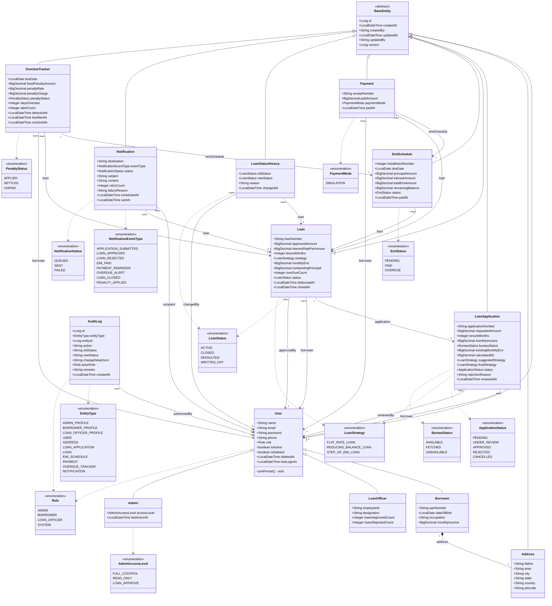

## Module 1 · Core (Entities & Enumerations)

---

## Module 2 · Services & Repositories

```mermaid
classDiagram
    direction TB

    class JpaRepository~T_ID~ {
        <<interface>>
        +save(T entity) T
        +findById(ID id) Optional~T~
        +findAll() List~T~
        +deleteById(ID id) void
    }

    class UserRepository {
        <<interface>>
        +findByEmail(String email) Optional~User~
        +existsByEmail(String email) boolean
    }

    class LoanRepository {
        <<interface>>
        +findByLoanNumber(String loanNumber) Optional~Loan~
        +countByStatus(LoanStatus status) long
        +countByBorrowerAndStatus(User borrower, LoanStatus status) Long
        +findByBorrowerAndStatus(User borrower, LoanStatus status) List~Loan~
        +findByBorrowerOrderByCreatedAtDesc(User borrower) List~Loan~
        +findByStatusAndUpdatedAtBefore(LoanStatus status, LocalDateTime dt) List~Loan~
        +sumActiveMonthlyEmi(Long borrowerId) Optional~BigDecimal~
        +sumAllApprovedAmounts() BigDecimal
        +getNextLoanSequence() Long
    }

    class LoanApplicationRepository {
        <<interface>>
        +existsByBorrowerAndStatusIn(User borrower, Collection~ApplicationStatus~ statuses) boolean
        +findByApplicationNumber(String num) Optional~LoanApplication~
        +findByBorrower(User borrower) List~LoanApplication~
        +findByStatusOrderByCreatedAtAsc(ApplicationStatus status) List~LoanApplication~
        +findByBorrowerOrderByCreatedAtDesc(User borrower) List~LoanApplication~
        +getNextApplicationSequence() Long
    }

    class EmiScheduleRepository {
        <<interface>>
        +findByLoanOrderByInstallmentNumberAsc(Loan loan) List~EmiSchedule~
        +findByStatusAndDueDateBefore(EmiStatus status, LocalDate date) List~EmiSchedule~
        +findUpcomingEmisWithBorrower(EmiStatus status, LocalDate date) List~EmiSchedule~
        +countByLoanAndStatusNot(Loan loan, EmiStatus status) Long
    }

    class PaymentRepository {
        <<interface>>
        +existsByEmiSchedule(EmiSchedule emiSchedule) boolean
        +findByLoan_LoanNumberOrderByPaidAtDesc(String loanNumber) List~Payment~
        +findByLoanOrderByPaidAtDesc(Loan loan) List~Payment~
        +findByReceiptNumber(String receiptNumber) Optional~Payment~
        +getNextReceiptSequence() Long
    }

    class NotificationRepository {
        <<interface>>
        +findByStatusAndRetryCountLessThan(NotificationStatus status, int maxRetries) List~Notification~
    }

    class OverdueTrackerRepository {
        <<interface>>
        +findByEmiSchedule(EmiSchedule emiSchedule) Optional~OverdueTracker~
        +findByResolvedAtIsNull() List~OverdueTracker~
        +findByLoanAndResolvedAtIsNull(Loan loan) List~OverdueTracker~
        +countByResolvedAtIsNull() long
        +sumOutstandingPenalty(PenaltyStatus status) BigDecimal
        +findMaxDaysOverdue() Integer
    }

    class AuditLogRepository {
        <<interface>>
        +findAllByOrderByCreatedAtDesc(Pageable pageable) Page~AuditLog~
    }

    class LoanStatusHistoryRepository {
        <<interface>>
        +findByLoanOrderByChangedAtDesc(Loan loan) List~LoanStatusHistory~
    }

    class BorrowerRepository {
        <<interface>>
    }

    class LoanOfficerRepository {
        <<interface>>
    }

    JpaRepository <|.. UserRepository
    JpaRepository <|.. LoanRepository
    JpaRepository <|.. LoanApplicationRepository
    JpaRepository <|.. EmiScheduleRepository
    JpaRepository <|.. PaymentRepository
    JpaRepository <|.. NotificationRepository
    JpaRepository <|.. OverdueTrackerRepository
    JpaRepository <|.. AuditLogRepository
    JpaRepository <|.. LoanStatusHistoryRepository
    JpaRepository <|.. BorrowerRepository
    JpaRepository <|.. LoanOfficerRepository

    class AuthService {
        <<interface>>
        +register(RegisterRequest request) AuthResponse
        +login(LoginRequest request) AuthResponse
    }

    class AuthServiceImpl {
        -UserRepository userRepository
        -PasswordEncoder passwordEncoder
        -AuthenticationManager authenticationManager
        -JwtTokenProvider jwtTokenProvider
        +register(RegisterRequest request) AuthResponse
        +login(LoginRequest request) AuthResponse
    }

    class LoanApplicationService {
        <<interface>>
        +apply(LoanApplicationRequest request, User user) LoanApplicationResponse
        +cancelApplication(String applicationNumber, User user) void
        +getPendingApplications() List~LoanApplicationResponse~
        +getMyApplications(User user) List~LoanApplicationResponse~
    }

    class LoanApplicationServiceImpl {
        -LoanApplicationRepository loanApplicationRepository
        -LoanRepository loanRepository
        -DtiCalculationService dtiCalculationService
        -CreditBureauService creditBureauService
        -AuditService auditService
        -LoanApplicationMapper loanApplicationMapper
        -ApplicationEventPublisher eventPublisher
        +apply(LoanApplicationRequest request, User user) LoanApplicationResponse
        +cancelApplication(String applicationNumber, User user) void
        +getPendingApplications() List~LoanApplicationResponse~
        +getMyApplications(User user) List~LoanApplicationResponse~
    }

    class LoanService {
        <<interface>>
        +processDecision(String applicationNumber, LoanDecisionRequest request, User officer) LoanResponse
        +closeLoanIfCompleted(Loan loan) void
        +getMyLoans(User user) List~LoanResponse~
        +findById(Long id) Loan
        +findByLoanNumber(String loanNumber) Loan
    }

    class LoanServiceImpl {
        -LoanRepository loanRepository
        -LoanApplicationRepository loanApplicationRepository
        -DtiCalculationService dtiCalculationService
        -EmiScheduleService emiScheduleService
        -LoanStrategyFactory loanStrategyFactory
        -AuditService auditService
        -LoanStatusTransitionService loanStatusTransitionService
        -ApplicationEventPublisher eventPublisher
        +processDecision(String applicationNumber, LoanDecisionRequest request, User officer) LoanResponse
        +closeLoanIfCompleted(Loan loan) void
        +getMyLoans(User user) List~LoanResponse~
        +findById(Long id) Loan
        +findByLoanNumber(String loanNumber) Loan
    }

    class PaymentService {
        <<interface>>
        +simulatePayment(PaymentSimulationRequest request, User user) PaymentResponse
        +getPaymentsByLoanNumber(String loanNumber) List~PaymentResponse~
    }

    class PaymentServiceImpl {
        -EmiScheduleRepository emiScheduleRepository
        -PaymentRepository paymentRepository
        -OverdueTrackerRepository overdueTrackerRepository
        -PaymentMapper paymentMapper
        -ApplicationEventPublisher eventPublisher
        +simulatePayment(PaymentSimulationRequest request, User user) PaymentResponse
        +getPaymentsByLoanNumber(String loanNumber) List~PaymentResponse~
    }

    class EmiScheduleService {
        <<interface>>
        +generateSchedule(Loan loan, EmiCalculationStrategy strategy) BigDecimal
        +getScheduleByLoan(Long loanId) List~EmiScheduleResponse~
        +getScheduleByLoanNumber(String loanNumber) List~EmiScheduleResponse~
    }

    class EmiScheduleServiceImpl {
        -EmiScheduleRepository emiScheduleRepository
        -LoanRepository loanRepository
        -EmiScheduleMapper emiScheduleMapper
        +generateSchedule(Loan loan, EmiCalculationStrategy strategy) BigDecimal
        +getScheduleByLoan(Long loanId) List~EmiScheduleResponse~
        +getScheduleByLoanNumber(String loanNumber) List~EmiScheduleResponse~
    }

    class UserService {
        <<interface>>
        +getAllUsers() List~UserResponse~
        +deactivateUser(Long userId) void
    }

    class UserServiceImpl {
        -UserRepository userRepository
        -UserMapper userMapper
        +getAllUsers() List~UserResponse~
        +deactivateUser(Long userId) void
    }

    class AuditService {
        <<interface>>
        +log(AuditRequest request) void
        +getAllAuditLogs(Pageable pageable) Page~AuditLogResponse~
    }

    class AuditServiceImpl {
        -AuditLogRepository auditLogRepository
        -AuditLogMapper auditLogMapper
        +log(AuditRequest request) void
        +getAllAuditLogs(Pageable pageable) Page~AuditLogResponse~
    }

    class DtiCalculationService {
        <<interface>>
        +calculateInitialDti(BigDecimal monthlyIncome, BigDecimal internalEmi, BigDecimal externalEmi) BigDecimal
        +calculateFinalDti(BigDecimal monthlyIncome, BigDecimal internalEmi, BigDecimal externalEmi, BigDecimal newEmi) BigDecimal
        +suggestStrategy(BigDecimal dti, int tenureMonths) LoanStrategy
        +validateIncome(BigDecimal income) void
    }

    class DtiCalculationServiceImpl {
        +calculateInitialDti(BigDecimal monthlyIncome, BigDecimal internalEmi, BigDecimal externalEmi) BigDecimal
        +calculateFinalDti(BigDecimal monthlyIncome, BigDecimal internalEmi, BigDecimal externalEmi, BigDecimal newEmi) BigDecimal
        +suggestStrategy(BigDecimal dti, int tenureMonths) LoanStrategy
        +validateIncome(BigDecimal income) void
    }

    class NotificationService {
        <<interface>>
        +send(User user, Loan loan, NotificationEventType eventType, String subject, String templateName, Map model) void
        +resend(Notification notification) void
    }

    class NotificationServiceImpl {
        -NotificationRepository notificationRepository
        -TemplateEngine templateEngine
        -JavaMailSender mailSender
        +send(User user, Loan loan, NotificationEventType eventType, String subject, String templateName, Map model) void
        +resend(Notification notification) void
    }

    class OverdueMonitorService {
        <<interface>>
        +scanAndMarkOverdue() void
        +scanAndMarkWrittenOff() void
    }

    class OverdueMonitorServiceImpl {
        -EmiScheduleRepository emiScheduleRepository
        -OverdueTrackerRepository overdueTrackerRepository
        -LoanRepository loanRepository
        -AuditService auditService
        -ApplicationEventPublisher eventPublisher
        +scanAndMarkOverdue() void
        +scanAndMarkWrittenOff() void
    }

    class LoanStatusTransitionService {
        <<interface>>
        +transition(Loan loan, LoanStatus newStatus, User changedBy, String reason) void
    }

    class LoanStatusTransitionServiceImpl {
        -LoanStatusHistoryRepository loanStatusHistoryRepository
        -AuditService auditService
        +transition(Loan loan, LoanStatus newStatus, User changedBy, String reason) void
    }

    class ReportService {
        <<interface>>
        +getOverdueSummary() OverdueSummaryResponse
        +getPortfolioSummary() LoanPortfolioResponse
        +getMonthlyCollections(Pageable pageable) Page~MonthlyCollectionResponse~
    }

    class ReportServiceImpl {
        -OverdueTrackerRepository overdueTrackerRepository
        -LoanRepository loanRepository
        +getOverdueSummary() OverdueSummaryResponse
        +getPortfolioSummary() LoanPortfolioResponse
        +getMonthlyCollections(Pageable pageable) Page~MonthlyCollectionResponse~
    }

    class PdfGeneratorService {
        <<interface>>
        +generatePaymentReceipt(Payment payment) byte[]
    }

    class PdfGeneratorServiceImpl {
        +generatePaymentReceipt(Payment payment) byte[]
    }

    class LoanApplicationMapper {
        <<interface>>
        +toResponse(LoanApplication application) LoanApplicationResponse
        +toResponseList(List~LoanApplication~ applications) List~LoanApplicationResponse~
    }

    class LoanMapper {
        <<interface>>
        +toResponse(Loan loan) LoanResponse
    }

    class EmiScheduleMapper {
        <<interface>>
        +toResponse(EmiSchedule emiSchedule) EmiScheduleResponse
    }

    class PaymentMapper {
        <<interface>>
        +toResponse(Payment payment) PaymentResponse
    }

    class AuditLogMapper {
        <<interface>>
        +toResponse(AuditLog auditLog) AuditLogResponse
    }

    class LoanStatusHistoryMapper {
        <<interface>>
        +toResponse(LoanStatusHistory history) LoanStatusHistoryResponse
    }

    class OverdueTrackerMapper {
        <<interface>>
        +toResponse(OverdueTracker tracker) OverdueTrackerResponse
    }

    class UserMapper {
        <<interface>>
        +toResponse(User user) UserResponse
    }

    AuthService <|.. AuthServiceImpl
    LoanApplicationService <|.. LoanApplicationServiceImpl
    LoanService <|.. LoanServiceImpl
    PaymentService <|.. PaymentServiceImpl
    EmiScheduleService <|.. EmiScheduleServiceImpl
    UserService <|.. UserServiceImpl
    AuditService <|.. AuditServiceImpl
    DtiCalculationService <|.. DtiCalculationServiceImpl
    NotificationService <|.. NotificationServiceImpl
    OverdueMonitorService <|.. OverdueMonitorServiceImpl
    LoanStatusTransitionService <|.. LoanStatusTransitionServiceImpl
    ReportService <|.. ReportServiceImpl
    PdfGeneratorService <|.. PdfGeneratorServiceImpl

    AuthServiceImpl ..> UserRepository
    LoanApplicationServiceImpl ..> LoanApplicationRepository
    LoanApplicationServiceImpl ..> LoanRepository
    LoanApplicationServiceImpl ..> DtiCalculationService
    LoanApplicationServiceImpl ..> CreditBureauService
    LoanApplicationServiceImpl ..> AuditService
    LoanApplicationServiceImpl ..> LoanApplicationMapper
    LoanServiceImpl ..> LoanRepository
    LoanServiceImpl ..> LoanApplicationRepository
    LoanServiceImpl ..> DtiCalculationService
    LoanServiceImpl ..> EmiScheduleService
    LoanServiceImpl ..> LoanStrategyFactory
    LoanServiceImpl ..> AuditService
    LoanServiceImpl ..> LoanStatusTransitionService
    PaymentServiceImpl ..> EmiScheduleRepository
    PaymentServiceImpl ..> PaymentRepository
    PaymentServiceImpl ..> OverdueTrackerRepository
    PaymentServiceImpl ..> PaymentMapper
    EmiScheduleServiceImpl ..> EmiScheduleRepository
    EmiScheduleServiceImpl ..> LoanRepository
    EmiScheduleServiceImpl ..> EmiScheduleMapper
    UserServiceImpl ..> UserRepository
    UserServiceImpl ..> UserMapper
    AuditServiceImpl ..> AuditLogRepository
    AuditServiceImpl ..> AuditLogMapper
    OverdueMonitorServiceImpl ..> EmiScheduleRepository
    OverdueMonitorServiceImpl ..> OverdueTrackerRepository
    OverdueMonitorServiceImpl ..> LoanRepository
    OverdueMonitorServiceImpl ..> AuditService
    LoanStatusTransitionServiceImpl ..> LoanStatusHistoryRepository
    LoanStatusTransitionServiceImpl ..> AuditService
    ReportServiceImpl ..> OverdueTrackerRepository
    ReportServiceImpl ..> LoanRepository
```

---

## Module 3 · Web Layer (Controllers & DTOs)

```mermaid
classDiagram
    direction TB

    class AuthController {
        -AuthService authService
        +register(RegisterRequest request) ResponseEntity
        +login(LoginRequest request) ResponseEntity
    }

    class BorrowerController {
        -LoanApplicationService loanApplicationService
        -LoanService loanService
        -EmiScheduleService emiScheduleService
        -SecurityUtils securityUtils
        +applyForLoan(LoanApplicationRequest request) ResponseEntity
        +cancelApplication(String applicationNumber) ResponseEntity
        +getMyApplications() ResponseEntity
        +getMyLoans() ResponseEntity
        +getLoanDetails(String loanNumber) ResponseEntity
        +getEmiSchedule(String loanNumber) ResponseEntity
    }

    class OfficerController {
        -LoanApplicationService loanApplicationService
        -LoanService loanService
        -ReportService reportService
        -LoanStatusHistoryRepository loanStatusHistoryRepository
        -OverdueTrackerRepository overdueTrackerRepository
        -SecurityUtils securityUtils
        +getPendingApplications() ResponseEntity
        +processDecision(String applicationNumber, LoanDecisionRequest request) ResponseEntity
        +getOverdueSummary() ResponseEntity
        +getPortfolioSummary() ResponseEntity
        +getMonthlyCollections(int page, int size) ResponseEntity
        +getLoanStatusHistory(String loanNumber) ResponseEntity
        +getLoanOverdueDetails(String loanNumber) ResponseEntity
    }

    class PaymentController {
        -PaymentService paymentService
        -PdfGeneratorService pdfGeneratorService
        -SecurityUtils securityUtils
        +simulatePayment(PaymentSimulationRequest request) ResponseEntity
        +getPaymentsByLoan(String loanNumber) ResponseEntity
        +downloadReceipt(String receiptNumber) ResponseEntity
    }

    class AdminController {
        -UserService userService
        -AuditService auditService
        +getAllUsers() ResponseEntity
        +deactivateUser(Long userId) ResponseEntity
        +getAuditLogs(int page, int size, String sortBy, String direction) ResponseEntity
    }

    class ApiResponse~T~ {
        +boolean success
        +int statusCode
        +String message
        +T data
        +LocalDateTime timestamp
        +ok(T data)$ ApiResponse~T~
        +ok(String message, T data)$ ApiResponse~T~
        +created(String message, T data)$ ApiResponse~T~
        +error(int statusCode, String message)$ ApiResponse~T~
        +validationError(T errors)$ ApiResponse~T~
    }

    class LoginRequest {
        +String email
        +String password
    }

    class RegisterRequest {
        +String name
        +String email
        +String password
        +String phone
        +Role role
        +BigDecimal monthlyIncome
        +String panNumber
        +String occupation
        +LocalDate dateOfBirth
        +Address address
        +String employeeId
        +String designation
        +Integer loansApprovedCount
        +Integer loansRejectedCount
        +AdminAccessLevel accessLevel
    }

    class LoanApplicationRequest {
        +BigDecimal requestedAmount
        +Integer tenureMonths
        +BigDecimal monthlyIncome
    }

    class LoanDecisionRequest {
        +Boolean approved
        +LoanStrategy overrideStrategy
        +BigDecimal interestRatePerAnnum
        +String rejectionReason
    }

    class PaymentSimulationRequest {
        +Long emiScheduleId
    }

    class AuditRequest {
        +EntityType entityType
        +Long entityId
        +String action
        +String oldStatus
        +String newStatus
        +User performedBy
        +Role actorRole
        +String remarks
    }

    class AuthResponse {
        +String token
        +Role role
        +String name
        +String email
    }

    class UserResponse {
        +Long id
        +String name
        +String email
        +String phone
        +Role role
        +boolean isActive
        +LocalDateTime createdAt
    }

    class LoanApplicationResponse {
        +Long id
        +String applicationNumber
        +BigDecimal requestedAmount
        +Integer tenureMonths
        +BigDecimal monthlyIncome
        +BigDecimal existingMonthlyEmi
        +BigDecimal calculatedDti
        +LoanStrategy suggestedStrategy
        +LoanStrategy finalStrategy
        +ApplicationStatus status
        +String rejectionReason
        +BureauStatus bureauStatus
        +LocalDateTime createdAt
        +LocalDateTime reviewedAt
        +String reviewedByName
    }

    class LoanResponse {
        +Long id
        +String loanNumber
        +Long applicationId
        +BigDecimal approvedAmount
        +BigDecimal interestRatePerAnnum
        +Integer tenureMonths
        +LoanStrategy strategy
        +BigDecimal monthlyEmi
        +BigDecimal outstandingPrincipal
        +Integer overdueCount
        +LoanStatus status
        +LocalDateTime disbursedAt
        +LocalDateTime closedAt
        +String approvedByName
    }

    class EmiScheduleResponse {
        +Long emiScheduleId
        +Integer installmentNumber
        +LocalDate dueDate
        +BigDecimal principalAmount
        +BigDecimal interestAmount
        +BigDecimal totalEmiAmount
        +BigDecimal remainingBalance
        +EmiStatus status
        +LocalDateTime paidAt
    }

    class PaymentResponse {
        +Long id
        +String receiptNumber
        +Long loanId
        +Integer installmentNumber
        +BigDecimal paidAmount
        +PaymentMode paymentMode
        +LocalDateTime paidAt
    }

    class AuditLogResponse {
        +Long id
        +EntityType entityType
        +Long entityId
        +String action
        +String oldStatus
        +String newStatus
        +String changeDetailJson
        +String performedByName
        +Role actorRole
        +String remarks
        +LocalDateTime createdAt
    }

    class LoanStatusHistoryResponse {
        +Long id
        +LoanStatus oldStatus
        +LoanStatus newStatus
        +String changedByName
        +String reason
        +LocalDateTime changedAt
    }

    class OverdueTrackerResponse {
        +Long id
        +Long loanId
        +Long emiScheduleId
        +String borrowerName
        +String borrowerEmail
        +LocalDate dueDate
        +Integer daysOverdue
        +BigDecimal fixedPenaltyAmount
        +BigDecimal penaltyRate
        +BigDecimal penaltyCharge
        +Boolean penaltySettled
        +Integer alertCount
        +LocalDateTime detectedAt
        +LocalDateTime resolvedAt
    }

    class OverdueSummaryResponse {
        +long totalOverdueCount
        +BigDecimal totalPenaltyOutstanding
        +int oldestOverdueDays
    }

    class LoanPortfolioResponse {
        +String loanNumber
        +long activeCount
        +long closedCount
        +long defaultedCount
        +long writtenOffCount
        +BigDecimal totalDisbursedAmount
    }

    class MonthlyCollectionResponse {
        +int year
        +int month
        +long totalPaymentsCount
        +BigDecimal totalAmountCollected
        +long overdueCount
        +BigDecimal totalPenaltyCharged
    }

    class ErrorResponse {
        +int status
        +String message
        +String path
        +Instant timestamp
        +String errorCode
    }

    class GlobalExceptionHandler {
        +handleApplicationException(ApplicationException ex, HttpServletRequest request) ResponseEntity~ErrorResponse~
        +handleValidationException(MethodArgumentNotValidException ex, HttpServletRequest request) ResponseEntity~ErrorResponse~
    }

    AuthController ..> AuthService
    AuthController ..> LoginRequest
    AuthController ..> RegisterRequest
    AuthController ..> ApiResponse

    BorrowerController ..> LoanApplicationService
    BorrowerController ..> LoanService
    BorrowerController ..> EmiScheduleService
    BorrowerController ..> LoanApplicationRequest
    BorrowerController ..> ApiResponse

    OfficerController ..> LoanApplicationService
    OfficerController ..> LoanService
    OfficerController ..> ReportService
    OfficerController ..> LoanDecisionRequest
    OfficerController ..> ApiResponse

    PaymentController ..> PaymentService
    PaymentController ..> PdfGeneratorService
    PaymentController ..> PaymentSimulationRequest
    PaymentController ..> ApiResponse

    AdminController ..> UserService
    AdminController ..> AuditService
    AdminController ..> ApiResponse

    GlobalExceptionHandler ..> ErrorResponse
```

---

## Module 4 · Security

```mermaid
classDiagram
    direction TB

    class OncePerRequestFilter {
        <<abstract>>
        +doFilterInternal(HttpServletRequest request, HttpServletResponse response, FilterChain chain) void
    }

    class UserDetailsService {
        <<interface>>
        +loadUserByUsername(String username) UserDetails
    }

    class AuthenticationEntryPoint {
        <<interface>>
        +commence(HttpServletRequest request, HttpServletResponse response, AuthenticationException authException) void
    }

    class JwtTokenProvider {
        -String jwtSecretKey
        -long jwtExpirationDate
        +generateToken(Authentication authentication) String
        +generateTokenForUser(User user) String
        +getUsername(String token) String
        +validateToken(String token) boolean
        -key() SecretKey
    }

    class JwtAuthenticationFilter {
        -JwtTokenProvider jwtTokenProvider
        -CustomUserDetailsService userDetailsService
        +doFilterInternal(HttpServletRequest request, HttpServletResponse response, FilterChain chain) void
        -getTokenFromRequest(HttpServletRequest request) String
    }

    class CustomUserDetailsService {
        -UserRepository userRepository
        +loadUserByUsername(String email) UserDetails
    }

    class SecurityUtils {
        -UserRepository userRepository
        +getCurrentUser() User
        +isOwner(Long resourceOwnerId) boolean
        +hasRole(String role) boolean
    }

    class JwtAuthenticationEntryPoint {
        +commence(HttpServletRequest request, HttpServletResponse response, AuthenticationException authException) void
    }

    class SecurityConfig {
        -JwtAuthenticationFilter jwtAuthenticationFilter
        -CustomUserDetailsService customUserDetailsService
        -JwtAuthenticationEntryPoint jwtAuthenticationEntryPoint
        +filterChain(HttpSecurity http) SecurityFilterChain
        +passwordEncoder() PasswordEncoder
        +authenticationManager(AuthenticationConfiguration config) AuthenticationManager
    }

    class DotenvEnvironmentPostProcessor {
        +postProcessEnvironment(ConfigurableEnvironment environment, SpringApplication application) void
    }

    OncePerRequestFilter <|-- JwtAuthenticationFilter
    UserDetailsService <|.. CustomUserDetailsService
    AuthenticationEntryPoint <|.. JwtAuthenticationEntryPoint

    JwtAuthenticationFilter --> JwtTokenProvider : validates tokens
    JwtAuthenticationFilter --> CustomUserDetailsService : loads user details
    CustomUserDetailsService --> UserRepository : finds user by email
    SecurityConfig --> JwtAuthenticationFilter : adds to filter chain
    SecurityConfig --> CustomUserDetailsService : configures auth
    SecurityConfig --> JwtAuthenticationEntryPoint : handles 401
    SecurityUtils --> UserRepository : loads current user
```

---

## Module 5 · Infrastructure (Strategies, Schedulers, Events, Integration, Exceptions)

```mermaid
classDiagram
    direction TB

    class EmiCalculationStrategy {
        <<interface>>
        +generateEmiSchedule(Loan loan) List~EmiSchedule~
        +calculateBaseEmi(Loan loan) BigDecimal
    }

    class FlatRateStrategy {
        +generateEmiSchedule(Loan loan) List~EmiSchedule~
        +calculateBaseEmi(Loan loan) BigDecimal
    }

    class ReducingBalanceStrategy {
        +generateEmiSchedule(Loan loan) List~EmiSchedule~
        +calculateBaseEmi(Loan loan) BigDecimal
    }

    class StepUpEmiStrategy {
        +generateEmiSchedule(Loan loan) List~EmiSchedule~
        +calculateBaseEmi(Loan loan) BigDecimal
    }

    class LoanStrategyFactory {
        -FlatRateStrategy flatRateStrategy
        -ReducingBalanceStrategy reducingBalanceStrategy
        -StepUpEmiStrategy stepUpEmiStrategy
        +resolve(LoanStrategy strategy) EmiCalculationStrategy
    }

    EmiCalculationStrategy <|.. FlatRateStrategy
    EmiCalculationStrategy <|.. ReducingBalanceStrategy
    EmiCalculationStrategy <|.. StepUpEmiStrategy
    LoanStrategyFactory --> FlatRateStrategy
    LoanStrategyFactory --> ReducingBalanceStrategy
    LoanStrategyFactory --> StepUpEmiStrategy
    LoanStrategyFactory ..> EmiCalculationStrategy : resolves

    class OverdueScheduler {
        -OverdueMonitorService overdueMonitorService
        +runOverdueScan() void
        +runWrittenOffScan() void
    }

    class PaymentReminderScheduler {
        -EmiScheduleRepository emiScheduleRepository
        -ApplicationEventPublisher eventPublisher
        +runPaymentReminders() void
    }

    class NotificationRetryScheduler {
        -NotificationService notificationService
        -NotificationRepository notificationRepository
        +retryFailedNotifications() void
    }

    OverdueScheduler --> OverdueMonitorService
    PaymentReminderScheduler --> EmiScheduleRepository
    PaymentReminderScheduler ..> ApplicationEventPublisher
    NotificationRetryScheduler --> NotificationService
    NotificationRetryScheduler --> NotificationRepository

    class LoanApplicationSubmittedEvent {
        +LoanApplication application
    }

    class LoanDecisionEvent {
        +Loan loan
        +LoanApplication application
        +ApplicationStatus decision
        +String rejectionReason
    }

    class PaymentReceivedEvent {
        +Payment payment
        +EmiSchedule emiSchedule
    }

    class PaymentReminderEvent {
        +EmiSchedule emiSchedule
    }

    class OverdueAlertEvent {
        +OverdueTracker tracker
    }

    class LoanClosedEvent {
        +Loan loan
    }

    class NotificationEventListener {
        -NotificationService notificationService
        +handleApplicationSubmitted(LoanApplicationSubmittedEvent event) void
        +handleLoanDecision(LoanDecisionEvent event) void
        +handlePaymentReceived(PaymentReceivedEvent event) void
        +handlePaymentReminder(PaymentReminderEvent event) void
        +handleOverdueAlert(OverdueAlertEvent event) void
        +handleLoanClosed(LoanClosedEvent event) void
    }

    NotificationEventListener --> NotificationService
    NotificationEventListener ..> LoanApplicationSubmittedEvent
    NotificationEventListener ..> LoanDecisionEvent
    NotificationEventListener ..> PaymentReceivedEvent
    NotificationEventListener ..> PaymentReminderEvent
    NotificationEventListener ..> OverdueAlertEvent
    NotificationEventListener ..> LoanClosedEvent

    class CreditBureauService {
        <<interface>>
        +fetchExternalEmi(String panNumber) ExternalDebtResult
    }

    class CreditBureauServiceImpl {
        -CreditBureauClient creditBureauClient
        -CreditBureauProperties creditBureauProperties
        +fetchExternalEmi(String panNumber) ExternalDebtResult
    }

    class ExternalDebtResult {
        +BigDecimal externalMonthlyEmi
        +String bureauStatus
    }

    class CreditBureauClient {
        -RestTemplate restTemplate
        -CreditBureauProperties creditBureauProperties
        +getDebtSummary(String panNumber) CreditBureauResponse
    }

    class CreditBureauProperties {
        +String baseUrl
        +long timeoutMs
    }

    class CreditBureauResponse {
        +BigDecimal externalMonthlyEmi
        +Integer bureauScore
        +String status
    }

    CreditBureauService <|.. CreditBureauServiceImpl
    CreditBureauServiceImpl --> CreditBureauClient
    CreditBureauServiceImpl --> CreditBureauProperties
    CreditBureauServiceImpl ..> ExternalDebtResult
    CreditBureauClient --> CreditBureauProperties
    CreditBureauClient ..> CreditBureauResponse

    class ApplicationException {
        <<abstract>>
        +String errorCode
        +HttpStatus status
    }

    class BusinessRuleException {
    }

    class ResourceNotFoundException {
    }

    class UnauthorizedAccessException {
    }

    class InvalidStatusTransitionException {
    }

    class LoanLimitExceededException {
    }

    class CreditBureauException {
    }

    class StrategyNotFoundException {
    }

    ApplicationException <|-- BusinessRuleException
    ApplicationException <|-- ResourceNotFoundException
    ApplicationException <|-- UnauthorizedAccessException
    ApplicationException <|-- InvalidStatusTransitionException
    ApplicationException <|-- LoanLimitExceededException
    ApplicationException <|-- CreditBureauException
    ApplicationException <|-- StrategyNotFoundException

    class EmiCalculationUtil {
        +calculateMonthlyRate(BigDecimal annualRatePercent)$ BigDecimal
        +calculateReducingBalanceEmi(BigDecimal principal, BigDecimal monthlyRate, int tenureMonths)$ BigDecimal
        +calculateFlatMonthlyPrincipal(BigDecimal principal, int tenureMonths)$ BigDecimal
        +calculateFlatMonthlyInterest(BigDecimal principal, BigDecimal monthlyRate)$ BigDecimal
    }

    class MoneyUtil {
        +roundHalfUp(BigDecimal value)$ BigDecimal
        +adjustFinalEmi(BigDecimal balance, BigDecimal interest)$ BigDecimal
    }

    class DateUtil {
        +emiDueDate(LocalDate disbursedOn, int installmentNumber)$ LocalDate
        +daysFromToday(int days)$ LocalDate
    }

    class ValidationUtil {
        +validatePan(String panNumber)$ void
        +validatePhone(String phone)$ void
        +validateIncome(BigDecimal income)$ void
    }

    class AsyncConfig {
        +taskExecutor() Executor
    }

    class JpaAuditingConfig {
        +auditorProvider() AuditorAware~String~
    }

    class SchedulingConfig {
        +taskScheduler() ThreadPoolTaskScheduler
    }

    class ApplicationConfig {
        +restTemplate() RestTemplate
    }

    class LoggingFilter {
        +doFilter(ServletRequest request, ServletResponse response, FilterChain chain) void
    }

    FlatRateStrategy ..> EmiCalculationUtil
    ReducingBalanceStrategy ..> EmiCalculationUtil
    StepUpEmiStrategy ..> EmiCalculationUtil
    FlatRateStrategy ..> MoneyUtil
    ReducingBalanceStrategy ..> MoneyUtil
    StepUpEmiStrategy ..> MoneyUtil
    FlatRateStrategy ..> DateUtil
    ReducingBalanceStrategy ..> DateUtil
    StepUpEmiStrategy ..> DateUtil
```

